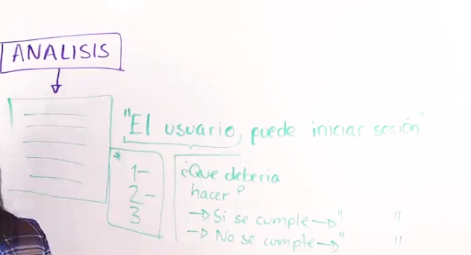
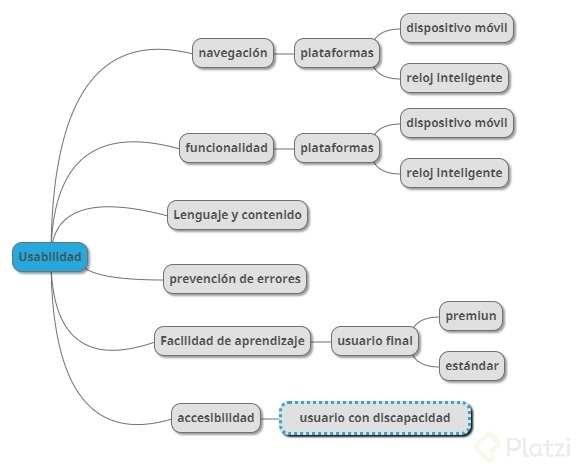

# Fundamentos-de-pruebas-de-software 

Link para revisar 
https://github.com/jeyfredc/Fundamentos-de-pruebas-de-software#Clase-1-Introducci%C3%B3n%5D

## ¿Qué son las pruebas?

Es el proceso de evaluar un producto, aprendiendo a través de la exploración y experimentación, 
lo cual incluye: Cuestionar, estudiar, modelar, observar e inferir, checar salidas de datos, etc.

## ¿Pasando todas las pruebas tendré un software sin errores?

> No. 

- El 100% de que un software no tenga errores nunca va a suceder; podrás llegar a estimaciones 
de 99.9999~ y quizás, dado el riesgo del software harás más pruebas pero siempre existe la 
posibilidad de que haya un nuevo fallo. 

- El tiempo y los clientes nos han enseñado que no importa, aún cuando tengas un muy buen plan de pruebas, 
siempre se pueden ir algunos detalles.

- Las pruebas las puedes tener que hacer por cuestiones de costo, prestigio, legales, o mejorar el software.

- Muchas empresas que desarrollan software:
	- No son parte de la solución.
	- No siempre se entrega la evidencia al cliente.
	- Sin una estructura o especificaciones son difíciles de mantener.No hay tiempo, o nadie del equipo hace pruebas.
	- Razones para hacer las pruebas
	- Tenemos un problema o el resultado no es el esperado.
	- Costo alto o fuera de presupuesto.
	- Implicaciones legales o de estándares tecnológicos.

## Proceso de pruebas de software y los estándares

- Metodología. Vendría siendo la parte en la que se establece el criterio o la estrategia 
  de cómo vas a llevar a cabo tus pruebas; ya sea quiénes van a ser los responsables, 
  cómo se va a entregar el material, etc.

- Herramientas. Contar con herramientas adecuadas te va a permitir acelerar el trabajo de testing,
  porque muchas veces los equipos no trabajan en el mismo lugar.

- Recursos. Aunque tú quieras hacer pruebas, si no estás preparado con el tiempo 
  esas carencias se van a ir mostrando como defectos.

- Pruebas en el ciclo de vida del software

- Hay pruebas desde la concepción de los requisitos hasta su puesta final en producción.

> Nota De acuerdo aun estudio de IBM Systems Science Institute, 
  64% de les errores se producen durante el análisis y el diseño.

## ¿Qué vamos a revisar durante las pruebas?

- Calidad del producto. Si se está creando el software correctamente.
	- Requerimientos
	- Diseño
	- Código
	- El sistema

- Calidad del proceso. Si alguien que es tu cliente no te especifica qué 
  es lo que quieres, vas a crear un producto que no cubre las necesidades 
  de tu cliente, así que una parte que se puede siempre tener en cuenta 
  para evaluar como criterio de calidad pueden ser, los datos de 
  salida del producto, o el proceso de calidad si se está siguiendo paso a paso.
	- Estándares
	- Procedimientos
	- Procesos del proyecto

## Certificaciones, estándares y metodologías

Una empresa para siempre poder proveer de un producto que cumpla las expectativas del cliente 
se puede enfocar en varias cosas.

	- Para individuos
	- Para procesos
	- Para empresas
	- Para servicios/productos = software/hardware
	- Para tipo de industrias
	
## Ciclo de vida del software

- Es necesario hacer pruebas en todas las fases del desarrollo de software ya que 
  un error encontrado en una etapa tardía puede generar costos muy elevados.

- Errores detectados lo antes posible reducen los costos y son mucho más fáciles de corregir.

- El ciclo de vida permite que los errores se detecten lo antes posible y por lo tanto, 
  permite a los desarrolladores concentrarse en la calidad del software, en los plazos de 
  implementación y en los costos asociados.
  
- Si hacemos las pruebas durante cada fase del ciclo de vida del software tendremos al final 
  del ciclo un producto validado y robusto de acuerdo a las necesidades del cliente  
  
  - Ciclo de Vida 
  
  
## Proceso de pruebas del software: Calidad y Defectos

> La calidad es una percepción entre lo deseado, analizado y lo que vamos a entregar. La calidad la define el cliente, 
  si esa persona esta satisfecha con lo entregado hasta ahí llega la calidad.

- Verificación: Es ir en cada etapa revisando que se cumpla lo propuesto por el cliente.
- Validación: Antes de entregar al cliente, validamos que efectivamente el conjunto de requerimientos esta siendo cumplido con lo entregado.
- Anomalia: La manifestación de un error en el software, eso es cuando existen errores asisteciales o magia negra, fuciona hoy y al rato no. 
- Error: una acción humana que produce un resultado incorrecto, es mala interpretació del sistema 
- Defecto: imperfección o deficiencia e un producto, el cual no cumple sus requerimientos o especificaciones y necesita ser reparado o remplazado.
- Fallo: el cese de la habilidad de un producto de cumplir una función requerida o su inhabilidad de funcionar dentro de márgenes previamente especificados.
- Problema: dificultad o incertidumbre experimentada por una o más personas, como resultado de un encuentro insatisfactorio con el sistema usado.  
  
  - Fase de Pruebas
    
  
  - Fase de Pruebas Tiempo
      
  
  
  ## Principios del testing moderno
  
 

> Los principios creados por Allan Page y Brenn Jensen es acerca del testing moderno, 
que es la evolución natural del testing ágil. Veían la necesidad de que el tester y el 
desarrollador evolucionen en su perspectiva, ambos hacen software y entregan al mismo 
cliente, por lo tanto deben trabajar más como un equipo y no como entidades separadas. 

- El tester debería enfocarse en la calidad del sowftware, el desarrollador debería enfocarse a desarrollar la solución. 
- El tester va a ayudar al desarrollador a utilizar las mejores herramientas, a entender los procesos de pruebas, a mejorar la calidad de su desarrollo.

## Los 7 principios del testing moderno

> Los testers podemos comenzar a pasar de ser los dueños de las pruebas o la calidad, a ser los embajadores de la calidad del producto”.

- Nuesta prioridad es mejorar el negocio.
- Nosotros aceleramos al equipo, usamos modelos como Lean Thinking y Teoría de las Restricciones para ayudar a identificar, mitigar, priorizar y mitigar cuellos de botella en el sistema.
- Somos la fuerza para la mejora continua, ayudando al equipo a adaptarse y optimizar para tener éxito, en lugar de proporcionar una red de seguridad para detectar fallas.
- Nos preocupamos profundamente acerca de la cultura de calidad en el equipo, y asesoramos, lideramos y nutrimos al equipo para llevarlos a una cultura de calidad más madura.
- Nosotros creemos que le cliente es el único capaz de juzgar y evaluar la calidad de nuestro producto.
- Nosotros usamos datos de manera extensa y profunda para entender los casos de usos del cliente y entonces cerrar huecos entre hipótesis del producto e impacto del negocio.
>PD -> El 100% de mis errores es a causa de validar con datos pequeños hay que hacer mas pruebas con mas cantidad de datos 
- Expandimos las habilidades de testing y el conocimiento en todo el equipo; entendemos que esto reduce o elimina la necesidad de un especialista dedicado al testing.

## Especialidades del testing

- Tipo de Testing
      
  
- Manual tester: Nos ayuda a definir los caso de prueba, establecer estrategias, pensamiento lateral.
- Automation tester: se encarga de agilizar y acelerar el trabajo, programación.
- Security tester: Encargado de la seguridad, protocolos y estándares.
- Data Science tester: Analiza, agrupa y limpia datos, análisis y limpieza de datos.
- SDET: es un desarrollador que sabe hacer pruebas, integración continua.
- DEVOPS: conoce todo lo anterior y domina el conocimiento de automatizar el proceso, entrega continua.
- QA Engineer: enfocado en el producto y el proceso, procesos de calidad.
- QE: Es un coach para el equipo, soluciones y estrategias de calidad.
- PD: QA: es la persona encargada de asegurar la calidad del producto en todas las fases del proyecto, consiguiendo en muchas ocasiones prevenir posibles fallos futuros.
- PD: QE : es alguien que aplica ingeniería a distintas partes del proceso de desarrollo de software en beneficio de la calidad. Entre otras cosas, sus conocimientos en operaciones (infraestructura, servidores, plataformas)

## Presupuesto, Recursos, Tiempo y Actividades Clave

>Pruebas para las Metodologías Ágiles

- En contraste al modelo de cascada, _en un modelo ágil se escribe y actualiza un plan de prueba para cada lanzamiento. _

- El plan de prueba ágil incluye los tipos de pruebas realizadas en esa iteración. Los planes de prueba típicos en ágil incluyen:
	- El alcance de la prueba
	- Prueba de las nuevas funcionalidades agregadas en la iteración.
	- Las pruebas deben ser basadas en la complejidad de las características.
	- Pruebas de desempeño (carga y rendimiento)
	- Consideraciones de infraestructura
	- Plan de Mitigación de Riesgos.
	- Recursos
	- Entregables e hitos

### Fases De pruebas puntos a considerar 

- Análisis: Documentación de las especificaciones de los requerimientos. Se pueden hacer pruebas de las especificaciones, determinar las validaciones y el flujo de las validaciones.

** Análisis **
      

- Diseño: Establecer los diseños visuales. Se puede especificar longitudes, si se aceptan números - etc. Mensajes de salida, que sucede si todo está bien, acepta datos null.

** Diseño **
      

- Código: Se puede basarse en módulos - funciones - base de datos. Se puede basarse en backend.
** Código **
      

- Pruebas: Pruebas de Interfaz - Pruebas del canal - Pruebas de dispositivos. Todo esto haría la revisión de los requerimientos, verificación y validación. Con el cliente se hacen las pruebas de aceptación.	
** Pruebas **
      
  
  
## Estrategia de pruebas

- Las estrategias de prueba son aquellas que nos permiten conocer por donde comenzar. 
- Por donde vamos a hacer las pruebas, planearlas, identificarlas. 
- Para saber por donde comenzar podemos hacernos dos preguntas.

** VariedadPruebasA **
      

** EstrategiaA_Ejemplo **
   

** EstrategiaB_Ejemplo **
   

** EstrategiaC_Ejemplo **
   

** EstrategiaD_Ejemplo **
   

  
  > Nota: Mapas mentales https://www.mindmup.com/ 
  
## Testing en desarrollo de software  

** chek-testing **
   

> Testing: Es la exploración de una idea, aprender a conocer como sucede el flujo, se generan datos, se llenan formularios. Esto y la exploración de pruebas nunca terminan, siempre hay nuevas formas de conocer como el usuario esta usando el software

> Checking: Es cuando sabes qué esta pasando y te verificas que siga pasando. Como verificar una maleta antes de viajar para asegurarnos que guardamos todo.

> Testing = jugar con el software para ver que pasa ---- Checking = verificar que el software hace lo que se espera que haga
- Solo se ejecutan si sucede algo
- Se ejecutan cada que… libero nuevo código o software.
- Se ejecutan de manera programada. 

## Errores comunes durante la ejecución:
** Erores testing **
   

- Pruebas duplicadas: Al no tener una buena organización o comunicación con el equipo, la cobertura de pruebas puede ser duplicada, por ejemplo que algún otro miembro ya probó

- Pruebas similares: A veces se pueden crear pruebas que tienen que ver con el mismo flujo.

- Pruebas sin valor agregado: Aquellas que no están asociadas al negocio, se debe priorizar siempre.

- Pruebas caducadas: Se refiere a la tecnología por ejemplo que se esté usando ya que como sabemos se suelen ir actualizando.

> Cuando logramos distinguir correctamente entre pruebas y verificación es cuando entra la automatización de pruebas,
 con ella se usa un software especial para controlar y comparar los resultados obtenidos de los esperados, 
 es entonces una verificación repetitiva y automatizada.

### Desventajas de un mal uso de la verificación -> Mal empleado 

- Pobre cobertura de pruebas

- Falta de actualización

- Mal manejo de versiones

###  Ventajas de la verificación -> Bien empleado 

- Correr pruebas en paralelo o en múltiples plataformas

- Reducción de error humano

- Probar grandes cantidades de datos

- Una vez que se llega a la integración continua, es cuando con mayor razón se hace uso de la automatización como solución definitiva para la eficiencia del equipo de desarrollo digital y DevOps

## Testing ágil 

>Involucra a todos, no solo en al tester, todos en el equipo son tester. La persona con este rol 
se asegura de la mayor cobertura de pruebas tomando en cuenta todas las necesidades que cada uno 
de los miembros del equipo también esta intentando hacer que funcione. 

>El tester tiene que definir si se esta cumpliendo con los requerimientos funciones y los del equipo.

Estrategias Ágiles:

- El testing es de ““todo el equipo””
- El testing puede ser independiente
- Integración continua
- Testing guiado por pruebas (Test Driven Development)
- Desarrollo guiado por comportamiento (Behaviour Driven Development)
- Desarrollo guiado por las pruebas de aceptación (Acceptance Test Driven Development)

> PD: Como aporte sobre TDD y BDD:

- BDD y TDD (Testin Driver Developer) no son técnicas de testing, ambas son estrategias de desarrollo.
- Un Tester si puede utilizar estas estrategias pero debe escribir los escenarios antes de escribir código.
- TDD y BDD tienen el mismo objetivo(Red Green Refactor) la diferencia es que cada uno está enfocado a describir el escenario a diferentes roles, TDD es muy técnico y obliga al lector a saber interpretar código mientras que BDD ofrece una capa donde podemos describir las funcionalidades de forma que cualquier persona pueda entender(Gherkin)

### Que es TDD 
**Test-driven development (TDD) ** es una práctica de ingeniería de software que involucra otras dos prácticas:

- Escribir las pruebas primero (Test First Development), y

- Refactorización (Refactoring).

-  propósito del desarrollo guiado por pruebas es lograr un código limpio que funcione. 

- La idea es que los requisitos sean traducidos a pruebas

### Que son UT -> pruebas unitarias

- En primer lugar, se escribe una prueba y se verifica que las pruebas fallan.

- Se garantizará que el software cumple con los requisitos que se han establecido.

## Niveles de pruebas 

> Prueba de Componentes: 
- Componentes son aquellas cosas pequeñas que sueles ver en un video como el botón de pausa, volumen, adelantar, retroceder. 
- Cada una de esas acciones son un componente.

> Pruebas de integración: 
- Una aplicación tiene una serie de componentes que trabajando juntos forman un pequeño sistemas, pero cuando tienes varios de estos sistemas necesitas integrarlos entre ellos.

> Prueba de sistema: 
- Esta parte incluye que estás tomando en cuenta el contexto, no es lo mismo tener las mismas pruebas para iOS, Android y Web.

> Pruebas de aceptación: 
- Si ya probamos que nuestro elemento o acción funcionan, estás pruebas nos aseguran con o sin el cliente que tiene cubierta todas las necesidades requeridas en el software. 
- Es la última verificación.

## Tipos de pruebas

> Pruebas funcionales: 
- Cómo funciona un sistema, qué debe estar haciendo, cómo está interactuando el usuario con él.

> Pruebas no-funcionales: 
- El usuario puede estar experimentando otro tipo de cosas que aún funcionando puede tener la sensación de lentitud, falta de legibilidad o claridad. 
- Esas características de usabilidad están asociadas a estas pruebas.

> Pruebas estructurales: 
- Tienen que ver con la tecnología y el stack usado para construir nuestro producto. 
- Nos tenemos que asegurarnos que nuestra base de datos o servidor funcionen de la manera correcta. 
- Son conocidas como pruebas de caja blanca.

> Prueba de manejo de cambios: 
- Es probar nuevamente un componente ya probado para verificar que no ha sido impactado por actualizaciones.

## Pruebas estáticas y dinámicas

- Pruebas estáticas: Muchas veces no son consideradas en los proyectos porque significa revisar código, documentación, verificar información documentada de la forma correcta.

- Pruebas dinámicas: Se enfocan en comportamientos externos visibles durante la ejecución del software.

### Elementos, ¿Qué son?

Las definiciones de historias de usuario, criterios de aceptación, mockups.

- El diseño de la arquitectura

- Las pruebas (testware), puntos de verificación

-  Guías de usuario

- Verificación/revisión del código

###  Beneficios

- Detectar y corregir defectos de forma eficiente

- Identificar y priorizar la ejecución de pruebas en etapas posteriores

- Prevenir defectos: no fáciles de detectar durante las pruebas dinámicas y durante la etapa de análisis y diseño

- Cubrir aspectos como inconsistencias, ambigüedades, contradicciones, definiciones inexactas, definiciones redundantes

- Reducir el retrabajo e incrementar la productividad

- Reducir el costo y tiempo

- Mejorando la comunicación entre todos los miembros del equipo

### Herramientas: 

- Balsamiq, 
- Draw (mockups), 
- Sketch, 
- Figma (Diseño de interfaces), 
- Slack (comunicación con el equipo), 
- Jira, 
- Trello (Gestión), Confluence (Documentación)
- Gliffy
- Cacoo
- Mockflow
- Frame Box
- Wireframe cc

## Definición y diseño de pruebas

¿Qué hace un tester?
> Encontrar problemas
1. Si no encuentra problemas antes de que el producto sea entregado al cliente, entonces su testing es ineficiente.

> Documentar problemas
2. Si cuando encuentra problemas no sabe documentar y reproducir los pasos correctos su testing genera retrabajo y sube el costo.

> Comunicar problemas
3. Si como representante de la calidad del producto no sabe argumentar y proteger los intereses del negocio o los clientes, entonces su testing no agrega valor.

Ejemplos de Casos de pruebas: 

Diseño de caso de prueba:

-> Nombre
-> Descripción
-> Pasos
-> Resultados esperados
-> Resultados obtenidos

** EjemploDisenioPruebas **
  

## Caja Blanca, Gris y Negra

 

>Negra: No podemos observar cómo fue construida, no vemos el código, no sabemos su arquitectura, no tenemos nociones más que la interfaz que estamos interactuando.

- Partición de equivalencia
- Valores límite
- Tabla de decisiones
- Transición de estados
- Casos de usos

>Blanca: Es como una caja de cristal, puedo ver todo lo que hay adentro e incluso puedo ser parte del equipo que desarrolla el software.

- Cobertura de declaración
- Cobertura de decisiones

>Gris: Pueden ser la integraciones, cómo fluye el código y puedo ver como se transmiten los datos a través de las redes.

- Casos de negocios
- Pruebas End-to-End
- Pruebas de integración

## Gestión, monitoreo y control: Monitoreo y Seguimiento

### Gestión de Pruebas:

> Planeación: 
- Definir los objetivos de las pruebas es muy importante, al no tener una estrategia clara termina causando una pobre cobertura de pruebas. 
- Los elementos a considerar para una buena planeación son la estimación, recursos, el alcance y objetivo.

> Monitoreo y Control: 
- Durante el monitoreo lo que estamos buscando son esas métricas que nos digan si estamos llevando avances o tenemos retrasos. 
- Son nuestras alertas cuando nuestro plan no se esta ejecutando.

> Análisis: 
- Incluye decidir cuáles son esas prioridades que nos ayudará a definir qué debemos probar. 

> Diseño: 
- Normalmente cuándo estas iniciando las pruebas es necesario crear un mapa de ideas. 
- Después de esto, puedes realizar el diseño a detalle de qué va a incluir cada caso de uso. 
- Casos de alto nivel, diseñar y priorizar pruebas, identificar el entorno de pruebas, hacer una trazabilidad entre pruebas y sus condiciones.

> Implementación: 
- También nos aseguramos de contar con la estructura necesaria para realizar las pruebas, con un ambiente, datos y dónde documentar o realizar las pruebas.

> Ejecución: 
- En esta etapa los suites de pruebas se ejecutan de acuerdo al programa o el plan diseñado con anterioridad. 
- Se suelen agrupar los casos de pruebas para que no estén desorganizado y podemos hacerles un buen seguimiento.

> Finalización: 
- Cuando queremos cerrar el ciclo de las pruebas, necesitamos saber qué porcentaje se cubrió, ejecutó, cuántos defectos se derivaron, aprender lecciones sobre el proceso.

## Roles y Responsabilidades 

> Especialista en pruebas manuales: 
- Debe contar con un pensamiento lateral, sabe cuales son los casos de uso para cada área, ser organizado y capaz de priorizar.
- El tester manual, se enfoca en la estrategia, definición, ejecución y cobertura de pruebas para cumplir los requerimientos, echando mano de cualquier técnica para obtener información suficiente y así cumplir con las asignaciones correspondientes. 

> Especialista en pruebas técnicas: 
- Se encarga de estar en constante actualización para las herramientas a utilizar en la parte de automatización, debe ser autodidacta.
- El tester técnico, trabaja muy de cerca con el tester manual, mientras que el tester manual define las pruebas, el tester técnico acelera la capacidad de ejecución de las pruebas. Esto lo hace implementando herramientas que permitan la automatización de pruebas, o la correcta selección de datos de pruebas, o el monitoreo de la ejecución de las pruebas.

> Líder del equipo de pruebas: 
- Gestiona al equipo y es un facilitador para las actividades a realizar, como apoyar con el ambiente de pruebas, darle seguimiento a los defectos, revisar que los lineamientos se sigan.
- El líder de pruebas, generalmente dentro de sus responsabilidad es volverse un facilitador de servicios, información y herramientas para el equipo de pruebas, para poder estimar presupuestos, recursos y tiempos respecto al plan de desarrollo de software.

> Ingeniero de calidad: 
- Se dedica a la parte del proceso, es quien se encarga de establecer las políticas, mantener involucrados a los equipos, alineados a las prioridades del negocio; además de que verifica que todo esto se cumpla sobre todo para la entrega al cliente.
- El Ingeniero de calidad, ya no solamente está al pendiente del producto y los procesos, comienza a involucrarse más con el negocio, ayudando tanto a testers como cualquier otro miembro del equipo a llevar cabo pruebas que reduzcan, en todas las etapas del ciclo de vida del software, el error humano

## Retrabajo 

> Es la principal causa del retraso, de que la estimación de tiempo falle, de que costos suban. Cuando estos suceden aumentamos exponencialmente el trabajo de todos

- Falta o mala documentación
- Falta de capacitación o dominio en las herramientas utilizadas
- Falta de capacitación o dominio en el software a desarrollar
- Falta de comunicación

## Herramienta 

- [easyredmine](https://www.easyredmine.com/)

## Sistema de seguimiento de bugs

> La mala administración, malas prácticas o falta de seguimiento entorpece las tareas de todo el equipo sino que además sumamos el retrabajo en la mala documentación puede que nuestro proyecto se salga de presupuesto o tiempo.

### Razones por las que aparecen defectos:

- Hay presión de tiempo en la entrega del software
- Descuidos en el diseño
- Inexperiencia o falta de conocimiento
- Falta de comunicación en los requerimientos
- Diseño complejo de código
- Desconocimiento de las tecnologías usadas

### Preguntas a realizar para construir un proceso de gestión de bugs:

- ¿Qué debe de hacer la persona que encuentre el defecto?
- ¿En qué herramienta debe documentar el defecto?
- ¿Cómo vamos a almacenar la información?
- ¿Qué información requiere el equipo de desarrollo para poder resolver un defecto? 
- ¿Cuáles son los estatus que se manejan para que fluya la resolución del defecto?
- ¿Cuáles son los criterios de aceptación de cierre del defecto?

### Ejemplos Ciclo de gestion de Bugs

** Estilo circular **
  
  
** Estilo Flujo **
  
  
## Defectos y sugerencias

> Defectos: 
- Es aquello que no cumple los requerimientos funciones, de diseño, de arquitectura y es la consecuencia de un error humano en el código o la interpretación de la información.

> Sugerencias: 
- Es cómo la experiencia del usuario se ve afectado. La lentitud del proyecto, la legibilidad, combinación de colores, la forma de navegar no es adecuada.

## ¿Qué es la depuración?

Hacer testing o depuración son dos actividades diferentes. Mientras el testing sirven para encontrar defectos, la depuración nos permitirá entender por qué esta sucediendo este defecto y que actividades están implicadas en el. Ambas pueden ir de la mano y son muy importantes.

> Debugger: 
- Es una herramienta que nos ayuda a encontrar todos estos errores ya sea de sintaxis, advertencias de seguridad, etc. 
- Nos permite ejecutar línea por línea, detener la ejecución temporalmente, visualizar el contenido de las variables, cambiar el valor del entorno de ejecución para poder ver el efecto de una corrección en el programa.

### Beneficiados

- Programador: Requiere cada vez que programa ir depurando lo que ejecuta y escriba para que cumpla con su objetivo 
- Tester: Le ayuda a reducir el tiempo de análisis que después puede ser asignado para el desarrollador
- Analista: Puede ser para analisis de encontrar información de un historial sobre cómo se comporta un sistema.
- Objetivo: Vamos a analizar cómo se comporta el sistema, cómo se transfieren los datos, cómo se procesa la información. Tenemos la capacidad de tener nuestro código en cualquier momento para conocer cómo funciona.

## Pruebas de verificación

> Las pruebas de verificación sirven para confirmar que un cambio se haya hecho o un defecto se haya corregido. 

> Queremos verificar que lo que estamos buscando está en los requerimientos o documentación.

> Pruebas de verificación
- Tratan de reproducir el escenario fallido con los datos usados. Pero sería un error usar los mismo datos para después asumir que el error fue corregido.
- Se buscan nuevos escenarios donde se utilicen valores relativos. Como Otras plataformas, otros sistemas operativos, otros exploradores, otros dispositivos

> Pruebas de regresión
- La matrices de pruebas cuando se implementan otros dispositivos u otros exploradores nos ayuda a tenerlos en cuenta nuestros puntos de verificación para que no sufran un impacto. 
- La matriz de prueba nos funciona para casos donde no solo vemos los defectos sino que todo lo que ya funciona siga funcionando.
- Nos ayuda a tener una claridad con los casos de prueba claves que pueden ser automatizados.

> Documentación
- Comentarios en el código
- Documentación técnica
- Pruebas unitarias
- Pruebas específicas
- Matrices de pruebas
- Plan de pruebas

## Técnicas de depuración

> Técnicas de depuración:

- Debugging: Observar valores de variables, detener temporalmente la aplicación.
- Logs: Hacer un vaciado de cómo las variables van cambiando y es más fácil rastrear la información.
-Historial: Agiliza la forma de monitorear y observar los comportamientos de nuestro software. Comparando valores, agrupando información.
- Reportes: Observar anomalías, acelerar el tiempo de respuesta, prevenir ataques o fallas.

> Pasos para depurar:

- Ir al módulo que falla
- Establecer breakpoints
- Diseñar una matrix de pruebas
- Establecer los datos de prueba
- Comenzar a depurar

### Pasos para depurar:

Debugging

• Observar valores de variables
• Detener temporalmente la aplicación

Logs

• Almacenar los valores
• Rastreo de la información

Historial

• Capacidad de análisis forense
• Comparar valores
• Agrupar información

Monitor reportes

• Prevenir ataques o fallas
• Observar anomalías
• Acelerar tiempos de respuesta

Desventajas de no usar logs

• Visibilidad nula de errores
• Metodología de trabajo no estandarizada
• Accesos e información descentralizada
• Incremento del tiempo de respuesta

Ventajas de generar un historial / reporte

• Aplicar técnicas de Machine Learning
• Mejorar la gestión y el control de la información
• Detectar amenazas de red o virus
• Prevenir fugas de información, así como comportamientos inadecuados

Fases del Debugging

- Fase 1. Encontrar el Error
- Fase 2. Corregir el Error

Fase Pasos para Depurar

1. Ir al módulo que falla
2. Establecer breakpoints
2.1 a. En asignación de valores
2.2 b. Procesamiento de valores
2.3 c. Cambio de estados
4. Diseñar una matriz de pruebas
5. Establecer los datos de prueba
6. Comenzar a depurar

## Automatización de pruebas 

En esta unidad vamos a conocer las bases para la automatización de pruebas y podemos automatizar las siguientes tipos de pruebas.

- Pruebas unitarias: Tienen que ver con un pedazo de código que el desarrollador esta codificando, pero no tienen que ver con todo el flujo de negocio y proceso del software.

- Pruebas de integración: Cómo hacemos que el conjunto del equipo que libera pedacitos de software funcionen juntos y no hagan defectos adicionales.

- Pruebas funcionales o de aceptación: Estas pruebas no necesariamente forman parte de los requerimientos especificados por el cliente, una recomendación para automatizar estas pruebas es que deban cumplir con los requerimientos dados por el cliente.

- Test Driven Development: El desarrollo va a estar enfocado haciendo primera las pruebas y después el código. Haciendo que el desarollo sea muy específico con la mayor cobertura y no pongamos líneas de código que no van a funcionar o no se usan.

- Behavior Driven Development: Si primeros vamos a escribir las pruebas, debemos hacerlo bien y usando un lenguaje sencillo, simple para que la sirva al equipo para entender qué es lo que queremos hacer.

>nota: 
- Establecer standar en el proceso 
- usar framework de pruebas 

## Gherkin 
- Es un lenguaje de texto plano con estructura, usamos palabras que no son comandos 
- pero permiten entender en un modo de pseudocódigo qué es lo que se tiene que hacer. 
- Esta diseñado para ser fácil de aprender y ser entendido por todos.

> Ventajas

- Simple
- Palabras claves o keywords
- Estandariza los casos de uso
- Reduce el tiempo de diseño

> Principales keywords usados en Gherkin

- Feature
- Scenario
- Given, When, Then, And, But (Steps)
- Background
- Scenario outline
- Examples

** Gherkin **
  
  
## Resumen 

1. Hay que tener una buena comunicación con el cliente para entender los puntos críticos que desea en su software, además esto servirá al momento de aclarar defectos y sugerencias.
2. Al momento de desarrollar el software, el tester correspondiente debe asegurarse de que todo esté en orden (el tester de seguridad, el de devops, etc.).
3. Hacer una verificación en cada fase (con el algoritmo que la profesora nos mostró), así si se encuentran errores o cualquier cosa, estaremos a tiempo de corregir, reportar, y revisar.
4. Considerar cada contexto donde se puede llevar acabo la aplicación y realizar un testing completo.
  - 4.1 Ejecutar los niveles de prueba.
  - 4.2 Pruebas estáticas y dinámicas.
  - 4.3 En caso de ser necesario, ejecutar cajas blancas y negras.
5. Ir realizando pruebas de aceptación frente al cliente.
6. Hacia la parte final, realizar depuración.  

	   

  

