# Curso de Diseño para Programadores

## El proceso creativo

Los pasos del proceso creativo:

1.- Preparación: Investigar, recopilar.
2.- Incubación: Experimentar, sintetizar.
3.- Iluminación: Idear, imaginar.
4.- Evaluación: Criticar, replantear.
5.- Implementación: Construir, trabajar.

1-. Investigamos y recopilamos toda la información relativa a un problema o algo que queramos solucionar.
2-. Buscamos diferentes soluciones. Miramos como alguien ya lo soluciono.
3-. Aquí es donde se nos ocurre las ideas. Ideamos e imaginamos soluciones.
4-. Evaluamos si estas soluciones son prácticas, son viables. Vemos los fallos y si es necesario, replanteamos las soluciones.
5-. Construimos la idea hasta el producto final.

**La creatividad es algo que se desarrolla**

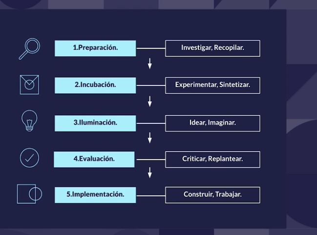 

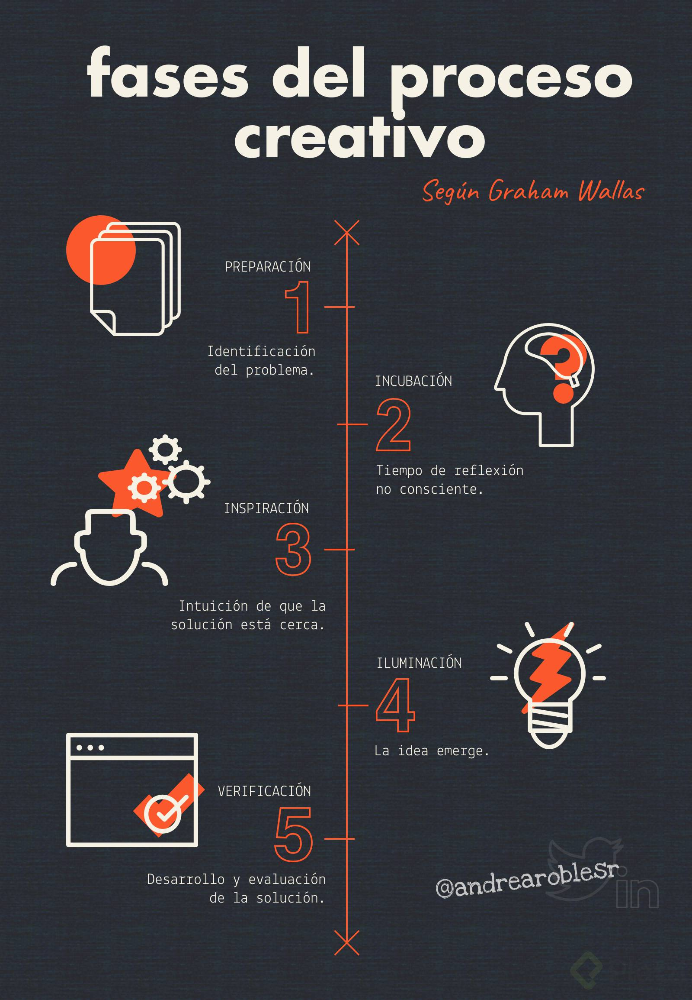 

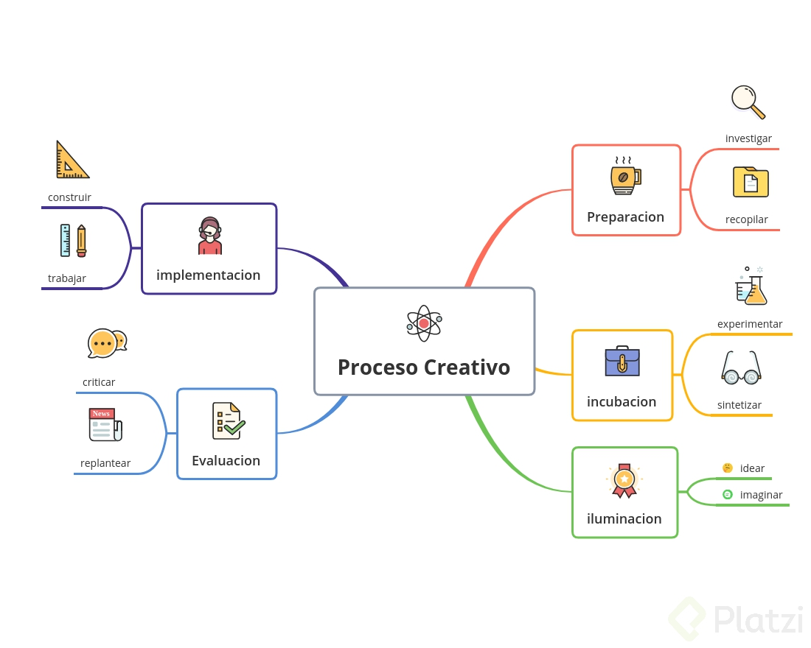 

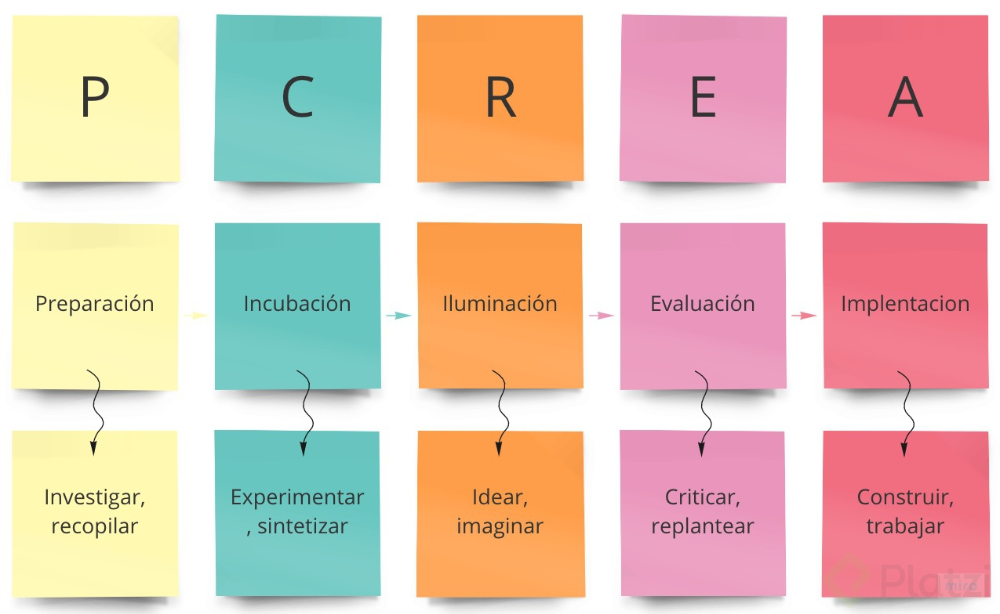 

## Herramientas para inspirar 
- https://codepen.io/
- https://www.behance.net/
- https://www.amazon.com.mx/dp/8425229294/?coliid=I2IPD2B38Y7IHP&colid=1ZBL8A5R1535M&psc=1&ref_=lv_ov_lig_dp_it

## Conceptos básicos de diseño

> Balance: 

- Posición de cada elemento está dada por su peso visual
a. Simétrico

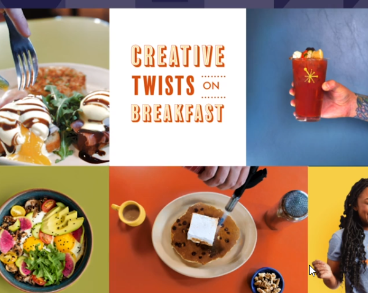 

b. Asimétrico

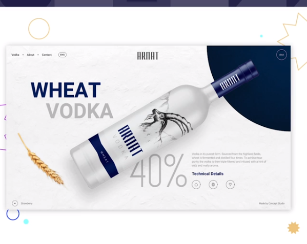 

> Contraste: 
- Señalar un concepto marcado por la diferencia entre 2 elementos distintos (claro obscuro, grande pequeño)
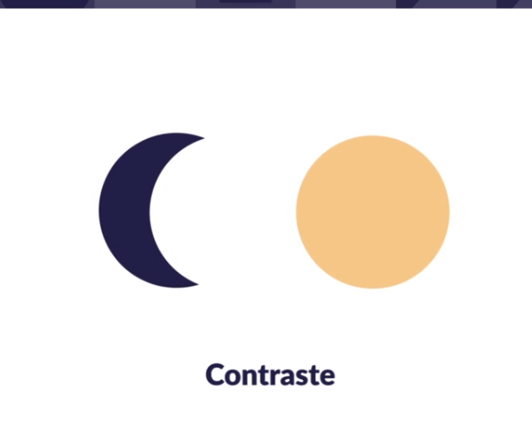 
 

> Alineación: 
- Crear rutas visuales
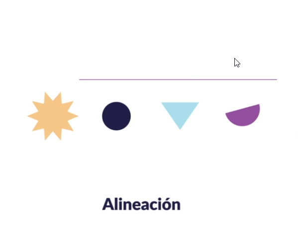 
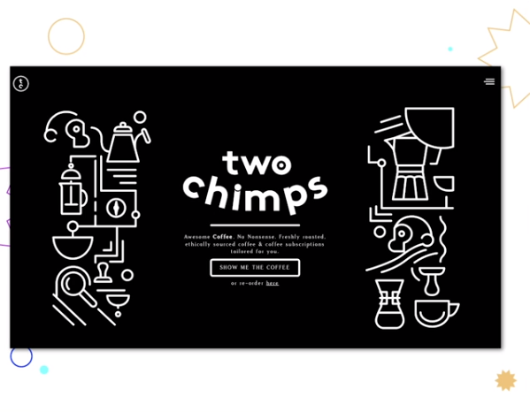 

> Proximidad: 
- Agrupar elementos
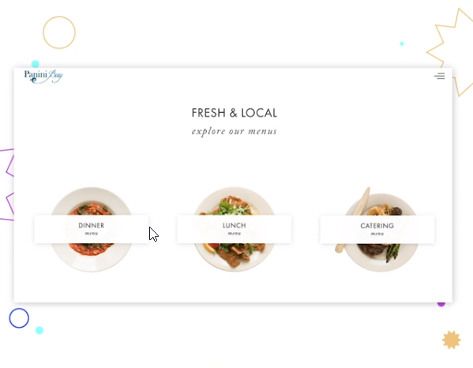 

> Repetición: 
- Concepto de marca
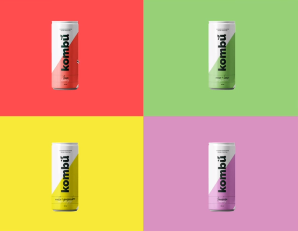 

> Espacio: 
- Como hacerle uso
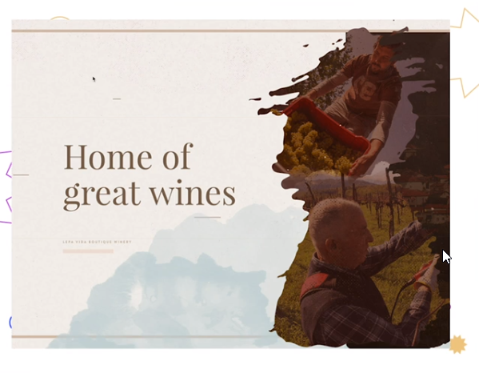 

> Notas
Balance ⇒ Existe el balance simétrico o asimétrico, permite proporcionar un peso visual claro de los elementos
Contraste ⇒ Marca la diferencia entre dos elementos distintos. Similar a buscarle las diferencias a dos objetos
Alineación ⇒ Define una ruta visual para mejorar la comunicación del mensaje hacia el usuario. Coloca la información relevante en orden
Proximidad ⇒ Define la clasificación de información, permitiendo un consumo mas ameno
Repetición ⇒ Ocupado para crear concepto de marca, consiste en repetir estilos o patrones de diseño para vincular un producto con un patrón de diseño
Espacio ⇒ La forma en que se pueden acomodar de diferente manera los objetos. Permite aprovechar de manera eficiente el espacio proporcionado

## Diseño responsivo (Responsive design)

> Es una metodología de diseño que nos permite crear diferentes diseños que sean adaptables a diferentes tipos de pantalla

**Conceptos:**

- Empezar por dispositivos móviles

- Garantiza que comencemos del contenido básico al complejo.

- Separa las capas de contenido y funcionalidad

- Garantiza el acceso al contenido de la pagina, sin necesidad de correr scripts, ejecutar alguna acción o alguna animación compleja.

- Usa sistemas de grillas y columnas

- Las columnas son una referencia del layout total de nuestra página y permiten ir mirando el ancho de nuestra página.

### DIFERENTES METODOLOGÍAS.

> Mejora progresiva. 
- (Progressive enhacement) 
- Se parte de una base donde tenemos solo los elementos esenciales del diseño para un movil, 
- Iremos ampliando la complejidad a medida que vamos subiendo hasta el PC.

> Degradación Agraciada. 
- (Graceful degradation) 
- Empezamos desde una versión completa y vamos reduciendo la complejidad a medida que bajamos de dispositivo.
- Este método se usa sobre todo cuando la web ya esta hecha y queremos adaptarla a móviles o tablets.

**Nota: **
- [Porque es importante firts mobil](https://medium.com/@Vincentxia77/what-is-mobile-first-design-why-its-important-how-to-make-it-7d3cf2e29d00)

## Brief y requerimientos técnicos 

>La palabra briefing surgió del lenguaje militar, cuyo significado tenía que ver con el detalle de las instrucciones que se daban en relación a una operación militar. Es así que brief significa información, memoria, informe.

>Para realizar un Plan de Medios es necesario, como en todo plan estratégico, contar con un claro itinerario a seguir, y este está dado por el Brief, que definirá el trabajo a efectuar, la asignación de recursos que para ello se contará y los medios y soportes que se utilizarán para llegar, de mejor manera, más eficiente y de manera más económica a la meta fijada.
La denominación “Brief” deriva del término inglés briefing, y la definición que le daremos es “asamblea o reunión cuyo fin es el de informar o definir oficialmente el trabajo a realizar y las tareas que incumben a los que participan en el proceso de difusión publicitaria, y es el esquema de trabajo que ordenará la tarea de todo aquél que esté involucrado en la tarea a realizar. Y es absolutamente necesaria la presencia del Brief, porque es imposible trabajar sin ningún sistema que nos ayude a evitar el caos organizativo. Porque sólo sabiendo dónde se quiere ir puede saberse como llegar. Es decir: los objetivos y el conocimiento acabado de la situación actual nos permitirán fijar cuáles son las estrategias más adecuadas para llegar a la meta.
El Brief es una serie de instrucciones y, también, el documento que la contiene, en las que el anunciante define concisamente su producto y su mercado e indica los objetivos que espera alcanzar mediante la campaña, objetivos que se refieren al producto, al mercado, a la publicidad o a los medios. Contiene indicaciones acerca de la parte que corresponde a la agencia en la tarea global, comprometiéndose él como fabricante a cumplir sus compromisos de inversión. Pero no siempre el Brief está completo, por lo que a veces es necesario indagar más en busca de información.

**La elaboración del Brief cumple tres etapas, de las que obtendremos:**

1) El Brief de producto, o del empresario anunciante.
2) El Brief de agencia.
3) El Brief publicitario.

Definamos:
- Brief de producto: La empresa realizará un informe con la mayor claridad y cantidad de datos posible, incluidas investigaciones de mercado, para que la agencia contratada realice su tarea. Además, la empresa debe incluir dentro de su informe su estrategia de marketing.
Sin embargo, no es raro que la empresa incluso delegue la realización de este informe a la misma agencia, si esta cuenta con una estructura que esté capacitada para la investigación de mercados. Si no es así, puede la agencia contratar servicios externos que se especialicen en estas lides.

- Brief de agencia: Una vez recibida la información del producto de mano del cliente, la agencia establece las estrategias adecuadas para cumplir con los objetivos que se han expuesto en el plan de marketing. Y es en este momento donde se establece con claridad cuál es el orden de insoslayable a seguir para el ejercicio de la tarea publicitaria.

- El Brief publicitario: En este informe se incluyen entonces, con transparencia y simplicidad, las estrategias establecidas en los pasos anteriores para su mejor ejecución en el camino a alcanzar los objetivos fijados.
Vemos a continuación un modelo de Brief publicitario, con el correspondiente desarrollo de cada punto de la estructura.

El primer elemento que debemos tener claro para construir una aplicación es el BRIEF.

¿Qué es el BRIEF? 

- Es la hoja de ruta para empezar a diseñar. 
- Es lo que se habló en los pasos del proceso creativo: investigar y recopilar toda la información relativa con el proyecto, con el problema a solucionar. 
- Es donde apuntamos esos datos que hemos recopilado.

**Brief**

- Hoja de ruta para empezar a diseñar.
- Resultado de las conversaciones con el cliente e incluye datos de un proyecto

**Secciones:**

- Descripción del cliente
- Objetivos o retos
- Audiencia
- Competencia
- Distribución
- Cronograma

**Ejemplo**
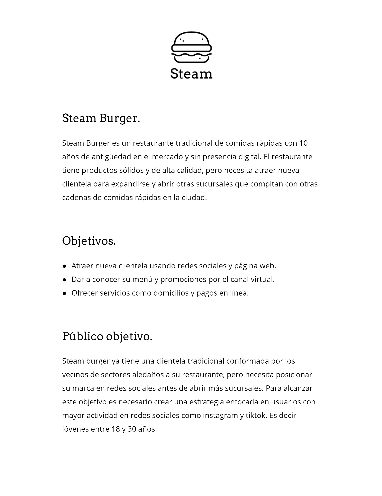 

> Como buena práctica, deben incluirse las respuestas a las siguientes preguntas:

- ¿Por qué estamos haciendo este proyecto?

- ¿Qué estamos tratando de lograr?

- ¿Por qué necesitamos este proyecto??

- ¿Por qué lo queremos realizar ahora??

- ¿Qué resultados de negocio esperamos de este proyecto de diseño?

- ¿Para quién estamos diseñando? – Esto requiere una descripción completa y precisa de la audiencia objetivo de este proyecto de diseño.

- ¿Quiénes son las organizaciones o personas clave? – Ej.: Ventas, Producción, Legal, Distribución, Compras, Distribuidores, Clientes, Usuarios finales, Recomendadores, Especificadores.

- ¿Cuál es el entorno de negocios actual y esperado?

- ¿Cuáles van a ser las fases del proyecto y sus costos??

- ¿Quiénes y cómo son los competidores??

- ¿Quiénes y con qué criterio aprobarán el proyecto?

- ¿Cómo se medirán los resultados?

**Nota: **
- [Brif Teoria Densa](https://rossami.com/kafka-y-praga-praga-y-kafka/lengua-mortal-no-dice-lo-que-dentro-sentia-leopardi/para-que-lean-y-con-gusto/que-es-el-brief-y-como-realizarlo/)

## Definición de diseño UX

> Debemos diseñar nuestro software para que sea amigable con el usuario. Este diseño se centra en los usuarios y en la usabilidad.

**Etapas **
- Investigacion ⇒ Recopilar informacion para conocer que ocupan los usuarios principalmente. Es bueno apoyarse de aplicaciones ya existentes para crear un buen diseño UX
- Analisis ⇒ Una vez recopilada la informacion se analiza y se obtienen los puntos importantes que debemos tener en cuenta al momento de crear el diseño
- Diseño ⇒ Se crean prototipos o sketches para visualizar el resultado
- Pruebas de usuario ⇒ Por lo general se llevan a cabo en los sketches para poder realizar ajustes antes de llevar el diseño a codigo

## Diagramas de flujo

Se deben traducir los objetivos (previamente establecidos en el brief) a requerimientos, de la siguiente manera:

1.- Dar a conocer sus productos = Menú y promociones.
2.- Aumentar la presencia en linea = Redes sociales.
3.- Hacer pedidos online = Pedidos.
4.- Dar a conocer su marca = Contacto y sucursales

- Diagrama de flujo (siteMAP): Lo utilizas para ver el mapa de todas las secciones del sitio web junto con su categoría.

**Ejemplo Diagrama de flujo (siteMAP)**
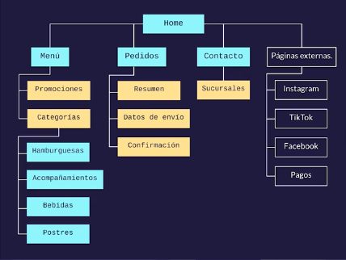 

- User flow: Es un diagrama general de los pasos que tiene que hacer un usuario (desde que llega a la pagina) para hacer una tarea.

**Ejemplo Diagrama Use Flow**
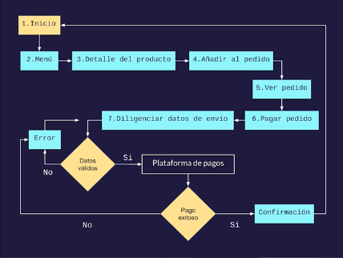 

## Wireframes y componentes

> Los wirefremes es simplemente llevar nuestra idea de la aplicación

- Es el plano de nuestra aplicación. 
- En ellos hacemos nuestros bocetos en papel de todos los componentes y pantallas que nos salieron en los flujos que hemos creado antes.
- Los WIREFRAMES dibujados a mano se consideran de baja calidad, pero con ellos podemos empezar a hacer pruebas de usuarios.

- Podemos hacer estas pruebas de muchas formas. Lo importante es ver la usabilidad de los componentes y pantallas, si son muy complejos para los usuarios finales.
- Los WIREFRAMES de alta fidelidad son los creados con programas de diseño.
- Esta parte es importante en diseño y también en desarrollo, porque en esta etapa los desarrolladores van a ver el tamaño de la aplicación final, y poder hacer estimaciones, además de decidir con que herramientas lo va a programar.
- También es importante que lo vea el cliente para que se haga una idea de que secciones va a tener su producto. 
- En esta etapa no se usan las paletas de colores. Solo es un boceto en blanco y negro o grises.

**Ejmeplos wireframe desktop**
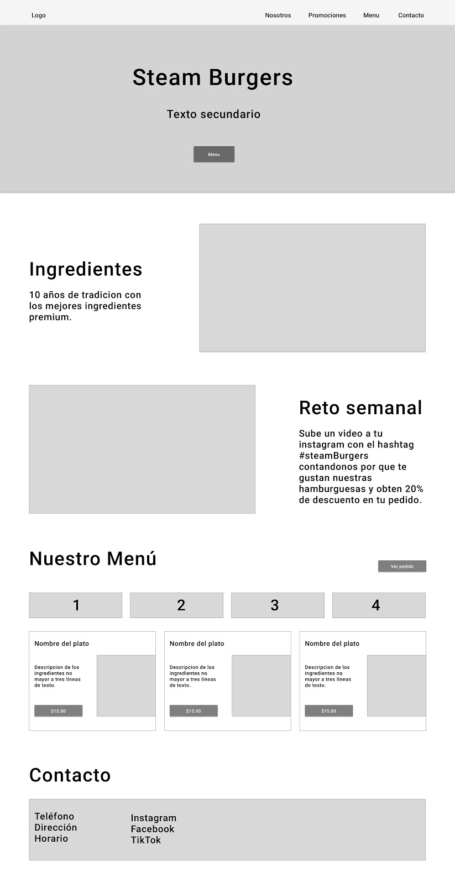 

**Ejmeplos wireframe mobile**
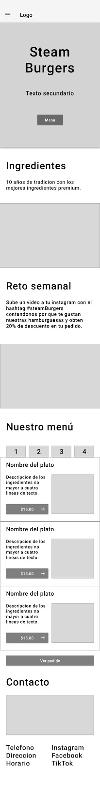 

### Herramientas 
- 
- 
- 
- 
- 

## Definición de diseño UX-UI 

> UX: 
- La experiencia de usuario, o User Experience es, como su nombre indica, la experiencia que tiene cualquier usuario cuando está interactuando con una plataforma digital, un dispositivo o cualquier otro entorno.

> UI: 
- Es el medio a través del cual el usuario se comunica con un sistema. 
- Te pongo ejemplos, cuando consulta el tiempo en su teléfono inteligente, cuando programa el microondas para calentar la comida, cuando le pide al gps del coche que le lleve a una dirección concreta, etc…

** UX**
 ['Diseño de interaccion', 'Prototipado', 'Arquitectura de la informacion', 'Investigacion y pruebas de usuario']

** UI**
['Diseño visual', 'Colores', 'Layouts', 'Tipografia']

**Ejmeplos  ux_ui**
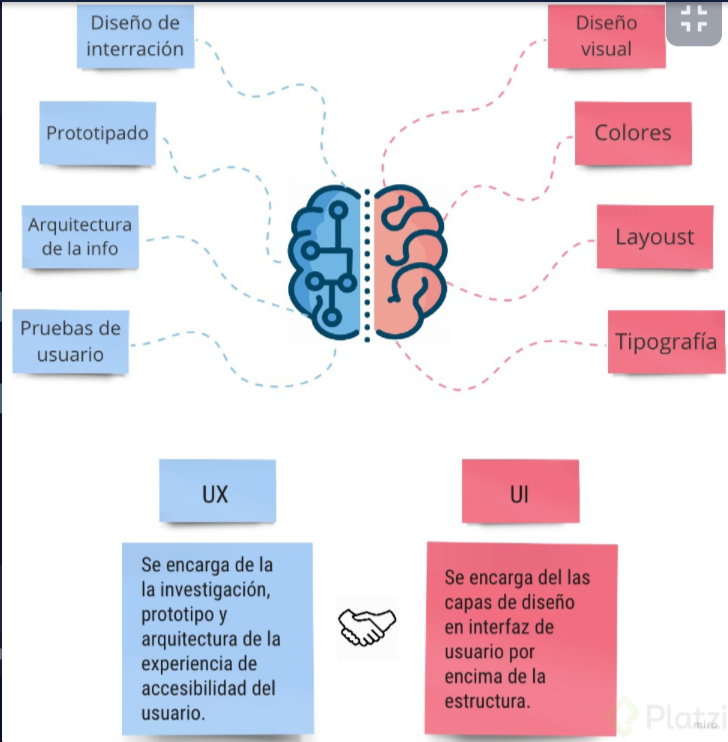 

## Moodboard y línea gráfica 

> El “moodboard” es la colección de referencias visuales que se usa como fuente de inspiración para un diseño

**Ejmeplos  MoodBoard **
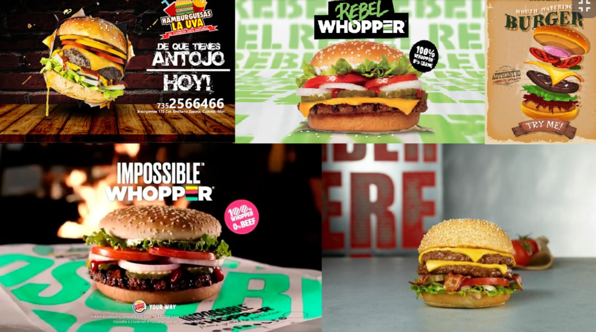 

### Herramienta
-[pinterest](https://co.pinterest.com/) 

## Teoría del color

Para saber que colores son los adecuados a un diseño aplicamos la teoría del color.

> Psicología del color. 

- Es un área de estudio que investiga la forma en la que el cerebro percibe los colores y los asocia a conceptos y sentimientos.

**Los colores se asocian a ciertos sentimientos:**
• Rojo: Pasión, deportes, comida, entretenimiento.
• Naranja: Diversión, arte, comida, eventos.
• Amarillo: Felicidad, comida, compras, ocio.
• Verde claro: Armonía, ambiente, comida, educación.
• Verde oscuro: Seguridad. Agro, bancos, inmobiliarias.
• Azul claro (celeste): Sabiduría, productos de niños, salud, tecnología.
• Azul oscuro: Confianza, finanzas, salud, seguros.
• Malva: Misterio, religión, productos alternativos.
• Rosa: Amor, belleza, moda, productos niños.
• Marrón (café): Estabilidad, agro, legal, construcción.
• Gris: Neutral, todas las industrias.
• Negro: Elegancia, todas las industrias.

La idea es que uses la teoría del color para elegir los colores de tu aplicación según el problema que resuelve.
Otros tips para seleccionar los colores:

• Utiliza color RGB y hexadecimales.
• Crea un código de color consistente. Que todos los componentes de la misma categoría tengan el mismo color.
• Menos es más. No satures de colores el sitio.
• Asegura que el color elegido es accesible.
• Define una paleta de color. Esto es un grupo de colores que vamos a usar en toda nuestra aplicación.

**Ejemplo**
 

## Paleta de color
Para poder construir una paleta de color debemos de tener claro los tipos de colores que existen
1. Colores primarios
	- Amarillo
	- Azul
	- Rojo
2. Colores secundarios
	- Son los que resultan de la combinación de los primarios
	- Amarillo + Azul = Verde
	- Verde + Rojo = Morado
	- Rojo + Amarillo = Naranja
3. Colores terciarios
	- Son los que se encuentran en el circulo cromatico entre un color primario y un secundario
	- Son la transición entre amarillo a verde
	- Verde a azul
	- Son los colores intermedios que resultan de la combinación de un color primario y un secundario

## Diferentes tipos de paletas
- Combinación monocromática (Un color + diferente opacidad)
- Combinación análoga (Consiste en combinar un color primario, uno secundario y uno terciario que estén seguidos en nuestro circulo cromático)
- Combinación complementaria (Consiste en combinar un color primario más un secundario)
	- Estos colores están opuestos el uno al otro en un circulo cromático y se pueden encontrar en cualquier gráfica del circulo cromático
- Combinación triádica (Consiste en crear un triángulo en la mitad del circulo cromático y a medida que se va girando el triángulo se visualiza como cada una de las puntas del triángulo apunta a un color)
- Combinación tétrada (Consiste en crear 4 colores, 2 primarios y dos secundarios. Se crea un rectángulo en medio del circulo cromático y se va girando)

Herramientas útiles para crear paletas de color
- [Adobe color](https://color.adobe.com/es/explore)
- [colorhunt](https://colorhunt.co/palettes/green)
- [coolors](https://coolors.co/palettes/trending)

https://platzi.com/p/LEONARDCUENCA/review/763ce0c9-a2cf-4852-a5f5-165848b741f7/ 

## Tipografiá :

- Número mínimo de fuentes
- Fuente estándar
- Limitar cantidad de texto
- Legibles en diferentes tamaños
- Altos de línea espaciados
- Contraste
- Evitar usar animaciones intermitentes
- Que tengan suficiente contraste el texto con el fondo.

### Reglas de combinación de tipografía: 

**Las fuentes tienen personalidad.**
- Serif: tradicional, sofisticada, confiable, práctica, formal… Se puede combinar con Sans Serif, scripts, display… y se suele usar en logos, textos de párrafos, títulos, impresos.
- Sans Serif: Moderna, limpia, humanista, geométrica, universal. Se combina con serif, script y slab serif. Sus usos son: logos, textos de párrafos, títulos y textos pequeños.
- Script o fuente cursiva: Elegante, clásica, formal, sofisticada y estilizada. Combina con serif y sans serif. Se usa en logos, títulos e invitaciones. También textos cortos que queramos destacar.

** Ejemplo ** 

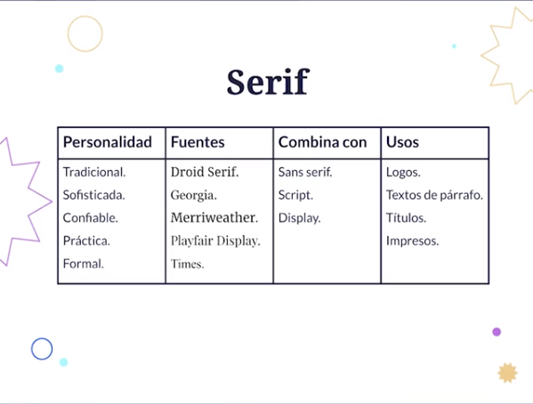 
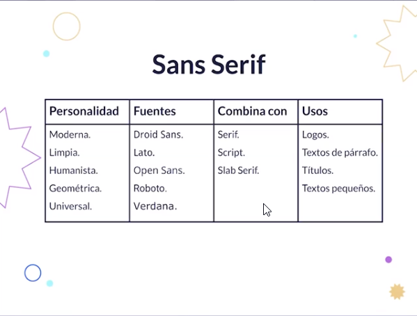 
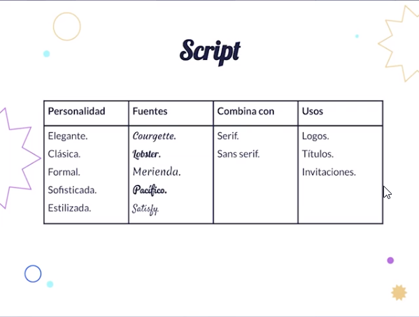 

### Herramienta: 

- https://fonts.google.com/

## Layout y sistemas de grillas 

### ¿Qué es una grilla?
Es un sistema de columnas creado por nosotros de acuerdo a las necesidades para ajustar nuestros elementos y componentes.
La mejor herramienta de CSS para crear una grilla es Grid.

- Sass es un pre-procesador de CSS te ayuda a escribir CSS de una manera más rápida y más fácil.
- Mixin es una clase que tiene dentro del pre-procesador, que te ayuda a manejar mejor los Breakpoints.

### Tenemos que configurar nuestros BreakPoints (Tipos de pantalla).
- $xs: 360px. Para móviles pequeños.
- $s:  440px. Para móviles con la pantalla más grande.
- $m:  768px. Para tablets.
- $l:  1280px. Para Ordenadores pantalla normal.
- $xl: 1440px. Monitores de alta calidad.

### Recomendaciones 
- Podemos usar un Mixin para manejar los distintos breakpoints más fácilmente.
- Después vamos a configurar nuestras variables dependiendo de los breakpoints.
- columns. Es el número de columnas que vamos a poner.
- column-gap es el espacio entre las columnas.

Creamos después una clase Grid para configurar cada uno de los elementos contenedores donde vamos a incluir nuestros componentes.
Finalmente le añadimos un display grid, que nos permite que toda esta configuración surta efecto. Y definimos un grip-column-gap para la distancia entre columnas y un grid-template-column que nos permite tener esta estructura.
Para definir el tamaño de un componente, se pone grid-column: 1/5, donde uno es la columna donde empieza, y 5 es la columna donde termina.

## Sistemas de componentes UI 

Una de las metodologías que podemos usar es separar la funcionalidad por componentes.
Un sistema de componentes es un conjunto de componentes que vamos a usar par crear nuestra aplicación. Esos componentes funcionan como una librería.
Puedes usar cualquier tecnología que prefieras. Lo importante es encapsular las funcionalidades en componentes. Cada componente tendrá su propio css y funcionalidad dentro de su propia función.
Así podremos importar esas características a cualquier pantalla de nuestra aplicación, reutilizando el código y haciendo más eficiente nuestra aplicación.
En la clase de Wireframe creamos unos bocetos de unos componentes, que luego dividimos en unidades de funcionalidad.
La idea es crear a partir del wireframe todos los componentes y funcionalidades, y después le añadimos la capa visual.

## Themes y customizaciones 

¿Qué es un themes? 

Es una capa de color y estilos que se añade por encima de nuestra aplicación y nos permite tener distintas variaciones sin hacer cambios drásticos en nuestro código. En otras palabras, theme es un archivo donde tenemos configurado la presentación visual de toda la aplicación. Teniendo dos o más theme podremos tener dos o más presentaciones visuales.

Para hacer los themes fácilmente podemos hacerlo por medio de variables de css o variables de Sass. Las variables de Sass son más sencillas.

## Imágenes para web

 > Imágenes para Web

- JPG: Imágenes con degradados (ligero pero sin tanta calidad)
- PNG: Fondo transparente
- SVG: Vectores, usados en iconos y animaciones
- GIF: En movimiento, es pesado

> Como elegir:

- Aporten al contenido
- Dirigido al cliente
- Consistente con la paleta de colores

> 👀 Licencias
**Rendimiento y accesibilidad**

- Evitar texto en las imágenes
- Exportar al tamaño del contenedor final
- Lazy loading: Cargando dinámico
- Texto alternativo

###Herrramientas 

- https://pixabay.com/
- https://morguefile.com/photos
- https://picjumbo.com/
- https://www.pexels.com/es-es/
- https://www.freepik.es/

## Gráficos en movimiento para web

### Formatos de gráficos en movimiento:
- CSS animado: Indicado para animaciones sencillas y transiciones.
- SVG animado: Indicado para animaciones de elementos vectoriales.
- JS (Canvas, WebGL): Indicado para animaciones complejas como animaciones de datos o 3D. Hay librerías en JS que sirven para este tipo de animaciones.
- Videos: Indicado para filmaciones o animaciones de alta complejidad y corta duración. Siempre preguntarnos: ¿realmente necesito este video? Pues son pesados y ralentizan la carga del sitio.

### ¿Cómo elegir gráficos en movimiento?

- Elegir animaciones que aporten al contenido. No sobrecargar con muchas animaciones.
- Procurar que no se reproduzcan automáticamente y si lo hacen, que no tengan sonido.
- Evita que tus animaciones tengan flashes. Los brillos continuos molestan y pueden ser dañinas.
- Si tus animaciones aportan contenido, añade subtítulos o transcripciones para que las pueda leer el lector de pantalla.
- Evita que las animaciones bloqueen la lectura básica del contenido. Es molesto una animación a la hora de leer, además de que el lector de pantallas no podrá acceder a ese contenido.
- Recuerda que las animaciones y los videos ralentizan la carga de la página. Se aplica nuevamente el menos es más.

### Herramientas 
- https://lottiefiles.com/

## Paso para el Diseño 

- Paso 1: Creamos nuestro Brief     -> Resumen de plan 
- Paso 2: Creamos nuestro site Map  -> Mapa del sitio de solución al brief 
- Paso 3: Creamos nuestro wireframe -> diseño en blanco y negro en Desk y Tablet 
- Paso 4: Creamos nuestro sketch    -> diseño con tonos de color e iconografias  en  Desk y Tablet 
- Paso 5: Definir componentes para evitar retrabajo 
- Paso 6: No olvides mostrar tu trabajo y tener mente abierta para los comentarios y criticas todo comentario es bueno para mejorar, claro obviando los comentarios toxicos. 

l titulo del libro de UX:
La Psicología de los objetos cotidianos
Autor: Donald A. Norman

