# Curso Básico de Python

## ¿Por qué Python?

**Campos de la tecnología: **

- Frontend: Se encarga de llevar el diseño de una aplicación o sitio web a código
- IoT: Se encarga de darle la capacidad de conectarse a internet a elementos que pueden estar a nuestro alrededor.
- IA: Se encarga de enseñarle a la computadora a resolver un determinado problema sin la necesidad de estar involucrados constantemente.
- Backend: Se encarga de crear la lógica con la cual va a funcionar una determinada aplicación y que va a ser almacenada en un servidor.
- DevOps: Se encarga de manejar la información almacenada en la nube de una determinada aplicación.
- Data Science: Se encarga de tomar la información relevante de un determinado ambiente y poder sacar conclusiones al respecto.
- Video juegos: Se encarga de combinar la programación, el diseño y la música para generar grandes experiencias a los usuarios.
- Desarrollo móvil: Se encarga de crear aplicaciones que serán almacenadas en la PlayStore o AppStore, y que podremos hacer uso de ellas desde nuestros smartphones

## El núcleo de un programa: los algoritmos 

> Un algoritmo es una serie de pasos ordenados para resolver un problema. Este es finito, ordenado, y no ambiguo

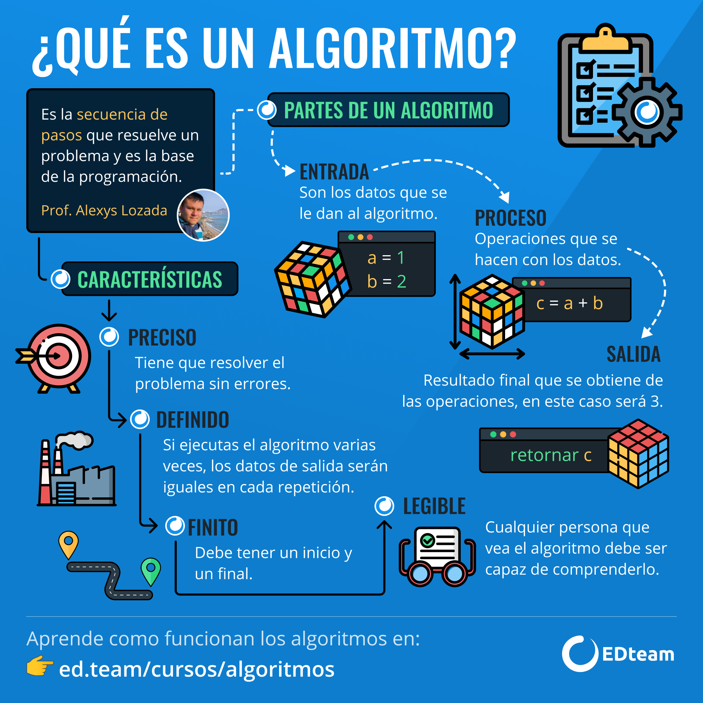

### Instalación de nuestras herramientas

Tres herramientas para escribir código:

4.1. Editor de código: Facilita la escritura del código, ya que da ciertas ayudas o resalta palabras claves del lenguaje de programación. Entre ellas están: Visual Studio Code, Sublime text, Atom, Pycharm.
El que recomienda y el que se va a utilizar es Visual Studio Code, porque es el más popular en la industria de tecnología y varios desarrolladores lo utilizan.

4.2. Consola: Programa que sirve para manejar la computadora sin necesidad de utilizar la interfaz gráfica.
Por ejemplo: CMD, power Shell, cmder.
Se utilizará cmder, porque tiene comandos compatibles con sistemas operativos del tipo Unix y Windows.

4.3. Lenguaje de programación: Python

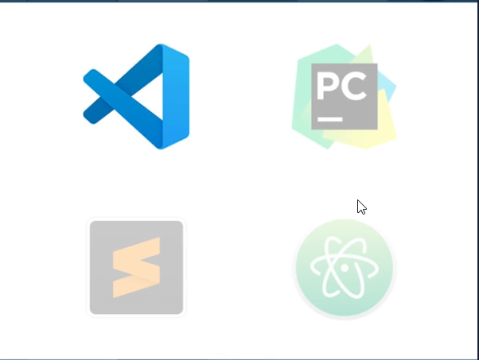

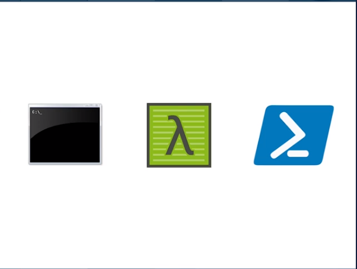

### Herramientas 
- https://cmder.net/
- https://code.visualstudio.com/ 
- https://www.python.org/downloads/ 

## Tu mejor herramienta: la consola 

Recordar comandos en consola es necesario ya hicimos el curso de consola pero seguimos tambien en el curso de bash shell. 
**Comandos **
- cd = change directory
- mkdir = make directory
- ls = dir 
- touch = crear un arhivo 
- exit()


## Explorando Python: operadores aritméticos

>PD: Si logramos intalar la consla cmder y python podremos usar Python en consola. 

**Pasos **
Paso 1: Ejecutamos cmder se abre la interfaz 
Paso 2: En windows py en Linux Python3 
Paso 3: se ejecutara en la consola y se mostrar asi >>> ya con esto podemos ejecutar operadores matematicos 5+5, 5*5, print(5+5)
Paso 4: Ya con esto podemos usar python en consola 

**Ejemplo**
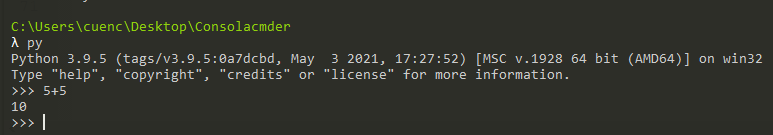

### Enlaces para practicar 
- https://aprendeconalf.es/docencia/python/manual/introduccion-python/

## ¿Qué es una variable?


>Es un lugar en memoria (una especie de caja) en el que podemos guardar objetos (números, texto, etc). Esta variable posee un identificador o nombre con el cual podemos llamarla cuando la necesitemos.

**Asignación de variables**

En python creamos las variables asignándoles un valor de la siguiente manera:

```Python

<identificador> = <valor>

````

### Reglas en el uso de identificadores

- No pueden empezar con un número.
- Deben estar en minúsculas
- Para separar las palabras usamos el guion bajo: _
- Estas reglas son aplicadas al lenguaje python, en otros lenguajes pueden haber otras reglas.

**Ejemplo**
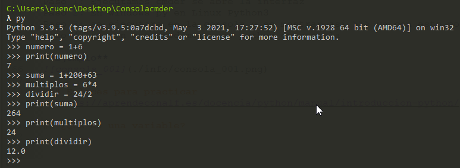


## Los primitivos: tipos de datos sencillos

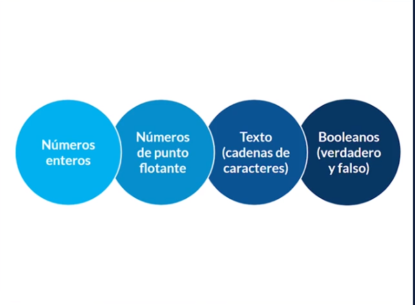

>Objetos
- Un objeto es una forma de modelar el mundo, en los lenguajes de programación se caracterizan por tener métodos y atributos. 
- En python todo es un objeto.

> Tipos de datos
- Podemos encontrar cuatros tipo de datos que vienen definidos por defecto en python, a estos tipos de datos los conocemos como primitivos.

Integers → Números Enteros
Floats → Números de punto flotantes (decimales)
Strings → Cadena de caracteres (texto)
Boolean → Boolenaos (Verdadero o Falso)
Notas

Algunos operadores aritméticos pueden funcionar para operar con otros tipos de datos, por ejemplo: podemos sumar strings, lo que concatena el texto o multiplicar un entero por un strings lo que repetirá el string las veces que indique el entero


** Tipos de datos en Python:**

- Text Type: str
- Numeric Types: int, float, complex
- Sequence Types: list, tuple, range
- Mapping Type: dict
- Set Types: set, frozenset
- Boolean Type: bool
- Binary Types: bytes, bytearray, memoryview

**¿Cómo saber el tipo de dato?**
type()

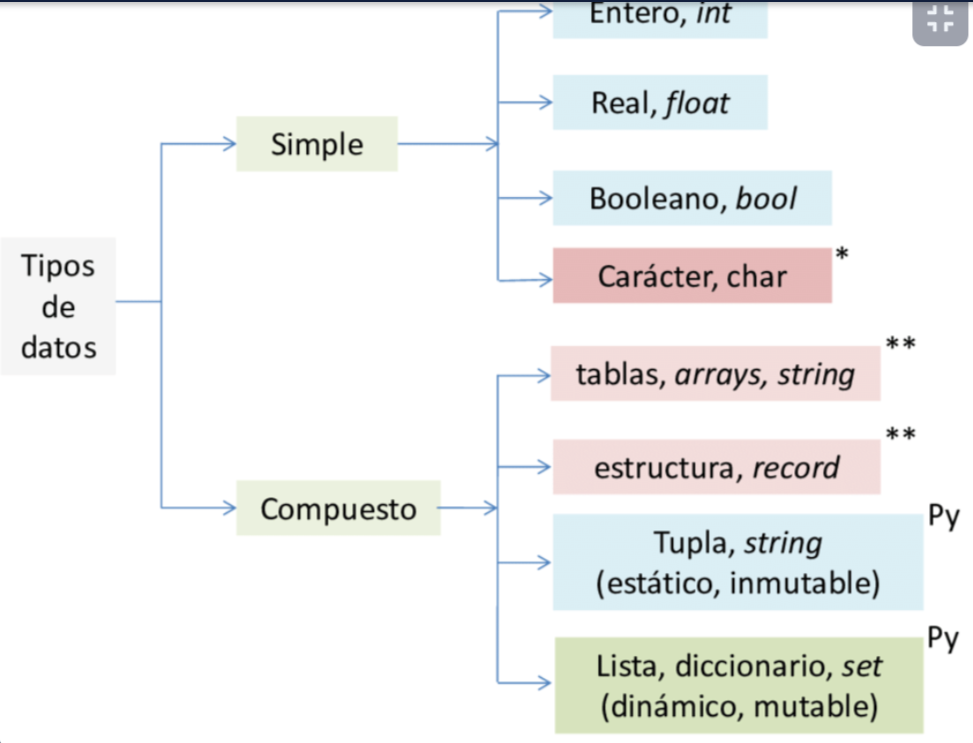

```Python 
x = 5
print(type(x))

"hola" + " " + "mundo" = "hola mundo"
"hola" * 4 = "holaholaholahola"
```


## Convertir un dato a un tipo diferente


Input("") para pedirle al usuario que introduzca datos.

int() con datos o variables dentro de parentesis para convertirlo en número entero.

str() para convertir números tanto decimales como enteros a strings.

```Python 
numero3 = int(input('Escribe un número: '))

>>> numero1 = input("agrega un número: ")
agrega un número: 55
>>> numero2 = input("agrega un número: ")
agrega un número: 45
>>> numero1
'55'
>>> numero2
'45'
>>> suma_numeros = numero1 + numero2
>>> suma_numeros
'5545'
>>> numero1 = int(numero1)
>>> numero1 = int(numero1)
>>> numero2 = int(numero2)
>>> numero1
55
>>> numero2
45
>>> suma_numeros = numero1 + numero2
>>> suma_numeros
100
>>> suma_numeros = str(suma_numeros)
>>> suma_numeros
'100'
>>>

```


## Operadores lógicos y de comparación

Los operadores logicos permiten realizar comparaciones y estos nos permite tomas decisiones: 

- TRUE / FALSE
- AND : Verdadero solo si todas son True
- OR: Es verdadero si hay al menos un valor True
- NOT: Solo invierte los valores
- != diferente de
- == igual

**Recuerden que:**
> Con AND
- True + True = TRUE
- True + False = False
- False + True = False
- False + False = False

**Mientras que con OR**
- True + True = TRUE
- True + False = False
- False + True = TRUE
- False + False = False

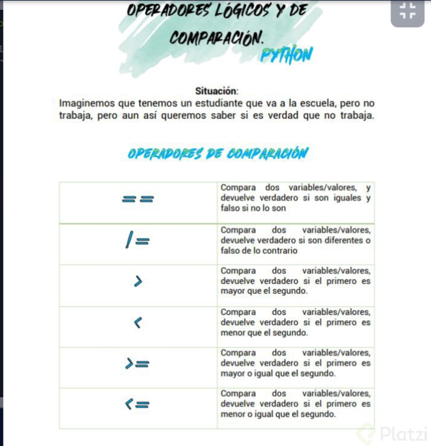


## como podemos ejecutar codigo py 

Paso 1: Es muy facil solo debemos tener nuestro archivo con extensión .py 
Paso 2: Nos ubicamos a la carpeta donde esta el archivo y ejecutamos py nombreArchivo 
Paso 3: Veras el resultado de estaforma  

```
PS C:\Users\cuenc\Desktop\Cursos\00_Fundamentos de Programación\03_Avanzado\09_CursoBasico_Python\codigo> py .\convertormoneda.py
¿Cuantos Pesos Mexicanos Tienes?:60000
 Tu total de dolares convertidos son:  2857.1428571428573$
PS C:\Users\cuenc\Desktop\Cursos\00_Fundamentos de Programación\03_Avanzado\09_CursoBasico_Python\codigo> 
```

## Construyendo el camino de un programa con condicionales

```Python
## Programa explicando condicional 
edad = int(input("Escribe tu edad:"))

if edad > 17: 
   print('Eres mayor de edad grandioso.') 
else: 
    print('Chato te falta edad.')   

if edad >= 30:
    print("jajaja llegaste a los 30 felicidades ")
elif edad <= 29 & edad > 20:
    print("Te falta poco");
else:
    print("Te falta edad amigo, disfruta tu juventud") 
```


## Construyendo funciones 
>Las funciones nos permiten encapsular bloques de código que sabes que se va repetir,  podemos declarar una función y que retorne un calculo un mensaje Etc.
>claro python tiene funciones propias como ejemplo round(),  capitalize(), srtip(), lower(), replace('original','remplazo'), nombre="leonard" nombre[0] len()
```Python
#Programa ejemplo para usar función 

#funcion sin parametros
def imprimir_mensaje():
    print("Mensaje especial:")
    print("Estoy aprendiendo:")

imprimir_mensaje()    

#funcion con parametros
valorA= "Hola mundo"
valorB= "Función con parametros"

def imprimir_mensaje_param(mensaje1, mensaje2):
    print(mensaje1)
    print(mensaje2)

imprimir_mensaje_param(valorA, valorB) 
```
>PD: Es recomendable dejar dos espacio este funciones 

## Trabajando con texto: slices 

```Python
#Programa ejemplo para partir texto 
nombre = Leonard

print(nombre[0:3])
Leo

print(nombre[0:3:2])
leo rd

print(nombre[::-1])
d

```

## Aprendiendo bucles

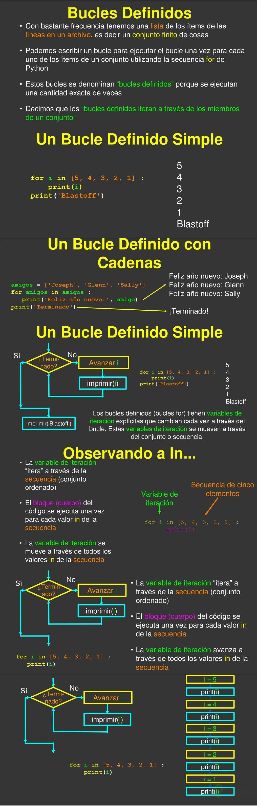

## El ciclo while

>El ciclo while es considerado un ciclo del tipo 0.X, debido a que es posible que el ciclo se repita de manera indefinida (X), 
>Dependiendo de la condición, no se ejecute ni una sola vez (0)

>El ciclo while nunca se ejecutará, dado que la condición es falsa antes de empezar el ciclo


> Nota: Para terminar la ejecución de un programa que entra en un bucle infinito, pulsar la combinación **CTRL+C**

```Python
#Programa DoWhile 

def run():
    LIMITE = int(input("Escribe un número limite: "))

    contador = 0
    potencia_2 = 2**contador
    while potencia_2 < LIMITE:
        print("2 elevado a " + str(contador) + " es igual a: " + str(potencia_2))
        contador = contador + 1
        potencia_2 = 2**contador


if __name__ == "__main__":
    run()
```


## Explorando un bucle diferente: el ciclo for

>El bucle for se utiliza para recorrer los elementos de un objeto iterable (lista, tupla, conjunto, diccionario, …) y ejecutar un bloque de código. En cada paso de la iteración se tiene en cuenta a un único elemento del objeto iterable, sobre el cuál se pueden aplicar una serie de operaciones.

var += 1: Seria lo mismo que decir, var = var +1, solamente es una forma de hacerlo mas corto y limpio el codigo

IMPORTANTE Siempre trata de traducir el codigo python al español

> range en Python es un tipo que se utiliza para representar una secuencia inmutable de números. 
- Uno de sus principales usos es junto a la sentencia for, para definir un bucle sobre el que se itera un número determinado de veces. La función incorporada (i.e. no necesita importarse) range() retorna una sucesión de números enteros. Cuando se le pasa un único argumento n, la sucesión
- range():


```Python
def tabla(numero):
    print('Esta es la tabla del ' + str(numero))
    for i in range(1,11):
        print(i*numero)


def run():
    menu = """
VAMOS A VISUALIZAR LAS TABLAS DE MULTIPLICAR
    Selecciona la tabla que quieras ver:
        a. tabla del 2
        b. tabla del 3
        c. tabla del 4
        d. tabla del 5
        e. tabla del 6
        f. tabla del 7
        g. tabla del 8
        h. tabla del 9
            
¿Qué tabla quires ver? Elige una opcion: 
    """
    opcion = str(input(menu))

    if opcion == 'a':
        tabla(2)
    elif opcion == 'b':
        tabla(3)
    elif opcion == 'c':
        tabla(4)
    elif opcion == 'd':
        tabla(5)
    elif opcion == 'e':
        tabla(6)
    elif opcion == 'f':
        tabla(7)
    elif opcion == 'g':
        tabla(8)   
    elif opcion == 'h':
        tabla(9)                         
    else:
        print('esa no es una opcion')


if __name__ == '__main__':
    run()```
	
	
## Recorriendo un string con for


for i in range(6):
        if i == 5:
            print("Figaroooo")
            break
        print("Galileo") 
## Interrumpiendo ciclos con break y continue

>Break 
```Python
for i in range(6):
        if i == 5:
            print("Figaroooo")
            break 
        print("Galileo")
```

>Continue
```Python
    # for contador in range(1000):
    #     if contador % 2 != 0:
    #         continue
    #     print(contador)

    # for i in range(10000):
    #     print(i)
    #     if i == 5678:
    #         break
```

## Modulos Python 

> Módulos
- Un módulo es un archivo con funciones ya predefinidas, y qué las tenemos disponibles para ejecutarlas. 
- Para traer/invocar un módulo, debemos escribir lo siguiente:

```
import random
```

>El módulo random de la librería estándar de Python incluye 
- Es un conjunto de funciones que permiten obtener de distintos modos números aleatorios o, para ser rigurosos, pseudoaleatorios.


>La función randint() 
- devuelve un número entero incluido entre los valores indicados. 
- Los valores de los límites inferior y superior también pueden aparecer entre los valores devueltos.

>La función randrange() 
- Devuelve enteros que van desde un valor inicial a otro final separados entre sí un número de valores determinados. 
- Esta separación (o paso) se utiliza en primer lugar con el valor inicial para calcular el siguiente valor y los sucesivos hasta llegar al valor final o al más cercano posible.

> La función random()
- Devuelve un número float entre 0 y 1

> La función uniform() 
- Devuelve un número float incluido entre los valores indicados.


## Almacenar varios valores en una variable: listas


> Estructuras de Datos: 
- Son formas que nos brindan los lenguajes de programación para guardar varios valores en una variable,  pero con diferente formato


> Listas: 
- Una lista es una estructura de datos y tipo de dato en python con caracteristicas especiales. 
- Lo cual nos permiten almacenar cualquier tipo de valor como enteros, cadenas y hasta otras funciones. 
- Son las estructuras más intuitivas para guardar varios tipos de valores en una misma variable


Ejemplo: 
```
mi_lista = [1, 2, 'chocolate', 'vainilla', TRUE]
```
> append()
- Añade un ítem al final de la lista:

```
lista = [1,2,3,4,5]
lista.append(6)
print(lista)

# [1, 2, 3, 4, 5, 6]

```
> copy(). 
- Regresa (copia), los elementos de la lista. 
```
new_list = list.copy()
```
> clear()
- Vacía todos los ítems de una lista:

```
lista = [1,2,3,4,5]
lista.clear()
#[]
```

>extend()
-Une una lista a otra:
```
l1 = [1,2,3]
l2 = [4,5,6]
l1.extend(l2)
#[1, 2, 3, 4, 5, 6]
```
> count()
- Cuenta el número de veces que aparece un ítem:

```
["Hola", "mundo", "mundo"].count("Hola")
#1
```
>index()
- Devuelve el índice en el que aparece un ítem (error si no aparece):

```
["Hola", "mundo", "mundo"].count("Hola")
#0
```
> insert()
- Agrega un ítem a la lista en un índice específico:
```
l = [1,2,3]
l.insert(0,0) #(index , element) first position 0, second last position -1
							#last position len
# [ 0, 1 , 2 , 3 ]
```
> pop()
- Extrae un ítem de la lista y lo borra:
```
l = [10,20,30,40,50]
print(l.pop())
print(l)

#50
#[10, 20, 30, 40]
Podemos indicarle un índice con el elemento a sacar (0 es el primer ítem):

print(l.pop(0))
print(l)

#10
#[20, 30, 40]
```
> remove()
- Borra el primer ítem de la lista cuyo valor concuerde con el que indicamos:
```
l = [20,30,30,30,40]
l.remove(30)
print(l)
#[20, 30, 30, 40]
```
> reverse()
- Le da la vuelta a la lista actual:
```
l.reverse()
print(l)
#[40, 30, 30, 20]
Las cadenas no tienen el método .reverse() pero podemos simularlo haciendo unas conversiones:

lista = list("Hola mundo")
lista.reverse()
cadena = "".join(lista)
cadena
#'odnum aloH'
```
> sort()
- Ordena automáticamente los ítems de una lista por su valor de menor a mayor:
```
lista = [5,-10,35,0,-65,100]
lista.sort()
lista
#[-65, -10, 0, 5, 35, 100]
Podemos utilizar el argumento reverse=True para indicar que la ordene del revés:

lista.sort(reverse=True)
lista
#[100, 35, 5, 0, -10, -65]
```


## ¿Qué son los diccionarios? 

> Diccionarios: 
- Son una estructura de datos mutable las cuales almacenan diferentes tipos de valores sin darle importancia a su orden. Identifican a cada elemento por una clave (Key). Se escriben entre {}.

> Operaciones:

- .keys() —> Retorna la clave de nuestro elemento

- .values()—> Retorna una lista de elementos (valores del diccionario)

- .items() —> Devuelve lista de tuplas (primero la clave y luego el valor)

- .clear() —> Elimina todos los items del diccionario

- .pop(“n”) —> Elimina el elemento ingresado

```
población_paises = {
	'Argentina': 44_938_712,
	'Brasil': 210_147_125,
	'Colombia': 50_372_424
}
```


> Inmutables:
- Strings (Texto)
- Int (Número entero)
- Float (Número de coma flotante)
- Decimal (Número decimal)
- Complex (Complejo)
- Bool (Booleano)
- Tuple (Tupla)
- Frozenset (Conjunto congelado)
- Bytes (8 bits)
- Range (Rango)
- None (Nulo)

> Mutables:
- List (Listado)
- Dict (Diccionario)
- Set (Conjunto)
- Bytearray (array de bits)
- MemoryView (Vista de la memoria)


- La función choice(secuencia) elige un valor al azar en un conjunto de elementos. Cualquier tipo de datos enumerable (tupla, lista, cadena, range) puede utilizarse como conjunto de elementos.
- La función join convierte una lista en una cadena formada por los elementos de la lista separados por comas.
- Choice solo funciona para elementos que no esten vacios.


- Una buena práctica es jamás nombrar archivos ni variables, funciones ni constantes en español
- Por convención, en el mundo del desarrollo se usa el inglés y los acentos o ñ pueden generar errores en algunos sistemas
- El módulo string nos permite generar cadenas de texto con todas las letras mayúsculas, minúsculas o símbolos, entre otras cosas
- El módulo random cuenta con muchas funciones útiles para generar valores pseudoaleatorios
- .choice: es una función del módulo random que retorna un valor al azar de una secuencia dada como parámetro
- .join: es un método del tipo de dato string que permite generar una cadena de texto dado un tipo de dato iterable, como una lista, tupla, diccionario, etc.


# Python Avanzado Segun!!! 

## El Zen de Python

> El Zen de Python se compone por los principios para escribir tu código de manera clara, sencilla y precisa. 

> Estos son:
- Bello es mejor que feo:
- Pyhton es estéticamente superior a cualquier otro lenguaje de programación. Al momento de escribir código, es mejor que sea de manera limpia y estética.
- Explícito es mejor que implícito:
- Hacer más fácil que las otras personas entiendan el código.
- Simple es mejor que complejo:
- Es mejor tener una implementación simple, que ocupe pocas lineas de código y sea entendible, a que sea una larga y complicada.
- Complejo es mejor que complicado:
- Si tenemos que extendernos en la implementación y hacerla más compleja para que el código si se entienda, esto es mejor que hacerlo simple y mal.
- Plano es mejor que anidado: El anidamiento es cuando tenemos un bloque de código dentro de otro bloque de código (dependiendo de este). Esto se nota en Python por la identación, nos quedarían estos bloques muy corridos a la derecha.
- Es mejor evitar el anidamiento, y hacer las cosas de manera plana.
- Espaciado es mejor que denso: Por la identación de Python (sus sangrías), este principio se nos hace imposible de esquivar. El código inevitablemente es espaciado.
- La legibilidad es importante: Es importante que otros programadores puedan entender lo que estamos escribiendo. Esto hace más fáciles las cosas cuando trabajemos con otros en los proyectos.
- Los casos especiales no son lo suficientemente especiales cpmo para romper las reglas (sin embargo, la practicidad le gana a la pureza):
- Siempre que podamos respetar estas reglas que nos plantea Python, es mejor así. Sin embargo, si por el hecho de hacer un código muy puro o muy ‘Pythonista’, este pierde legibilidad, es mejor ser más prácticos y romper o saltearnos algunas de estas reglas para que el código sea más eficiente. Por lo tanto, llegado el momento debermos decidir si es mejor hacer las cosas de manera pura o práctica.
- Los errores nunca deberían pasar silenciosamente (a menos que se silencien explícitamente):
- Manejar los erroes es fundamental. Cada error nos dice algo y hay que prestarle atención. A menos que seas capaz de silenciar un error explícitamente, aunque para esto hay que tener criterio.
- Frente a la ambiguedad, evitar la tentación de adivinar:Nuestro código debería solamente tener una interpretación. Si en un contexto significa algo, y en otro otra cosa, es mejor que lo revisemos y busquemos una solución.
- Debería haber una, y preferiblemente sola, una manera obvia de hacerlo. (A pesar de que esa manera no sea obvia a menos que seas holandés):
- Esto hace referencia al creador de Python ''Guido van Rossum", que de manera muy inteligente encontrar las soluciones precisas a los problemas, y deberíamos imitarlo.
- Ahora es mejor que nunca: Es mejor desarrollar nuestra solución cuánto antes, no dejarlo para mañana o para mas adelante.
- A pesar de que nunca es muchas veces mejor que ahora mismo: Si por hacer las cosas ya y tenemos poco tiempo, si es mejor dejarlo para después y no hacerlo apurado y mal.
- Si la implementación es díficil de explicar, es una mala idea, y si es fácil de explicar, es una buena idea:
- Si somos capaces de explicar nuestra implementación a otros desarrolladores paso a paso, es una buena idea. En cambio si no podemos hacerlo, significa que ni nosotros entendemos la implementación y deberíamos repensar nuestra forma de encarar la solución.
- **Los espacios de nombres son una gran idea, ¡Tengamos más de esos! (namespaces):
- Es el nombre que se ha indicado luego de la palabra import, es decir la ruta (namespace) del módulo. (Lo veremos a profundidad más adelante


## Pasos para mostrar el Zen de Python 

Paso 1: Abrimos consola claro siempre y cuando tengamos instalado python 
Paso 2: Escribimo py si estamos en windows o python3 si estamos en unix 
Paso 3: import this y nos mostrara en pantalla las reglas zen 

## ¿Qué es la documentación?

- Consultar informacion clara y directa
- Tener ejemplo de los mismos desarrolladores
- Referencias de todas las caracteristicas y funcionalidades en un solo lugar
- Conocer los nuevos features de nuevas actualizaciones
- Conocer el modo de empleo de versiones anteriores
- Aprender a manejar correctamente las herramientas
- Que contienen los modulos integrados dentro de python
- Como manejar los modulos
- Manejo y uso de frameworks
- Ser autodidacta

## Herramientas 
- (DOC Python)[https://docs.python.org/3/]
- (pep-0008 Estilo)[https://www.python.org/dev/peps/pep-0008/]
- (Tomar capturas de tu Código)[https://carbon.now.sh/]

## ¿Qué es un entorno virtual?

> Un entorno virtual es un directorio que contiene una instalación de Python de una versión en particular, además de unos cuantos paquetes adicionales.

> Pd: Un entorno virtual nos permite tener un Python separado para cada proyecto.

**Ejemplo:**
>La aplicación A puede tener su propio entorno virtual con la versión 1.0 instalada mientras que la aplicación B tiene otro entorno virtual con la versión 2.0. Si la aplicación B requiere que actualizar la librería a la versión 3.0, ésto no afectará el entorno virtual de la aplicación A.

## El primer paso profesional: creación de un entorno virtual


- Paso 1: Creamos un git init 
- Paso 2: `py -m venv nombre_venv` python3 -m venv -h -> -m == Modulo, venv = Entorno virtual , nombre_env||  Ejemplo ->  py -m venv venv -> Genera un carpeta con le nombre venv  Usualmente el nombre del ambiente virtual es venv.
- Paso 3:  Activación del ambiente virtual:
Windows: Debes estar en la raiz fuera de venv 
`.\venv\Scripts\activate`

Unix o MacOS:
`source venv/bin/activate`

!(venv)[./info/venv.png]

- Paso 4: Desactivar el ambiente virtual:

`deactivate`

Crear un alias en linux/mac:

alias nombre-alias="comando"

`alias avenv=“source venv/bin/activate”``


## Instalación de dependencias con pip

> Pip (package installer for python) Nos permite descargar paquetes de terceros para utilizarlos en nuestro enviroment, ademas se puede definir una versión especifica del paquete.


`pip install <paquete> instala el paquete(pandas , matplotlib, bokeh, etc) que se especifique`

> pip freeze muestra todos los paquetes instalados en tu ambiente virtual


- Si quisiéramos que alguien mas pueda ejecutar nuestro proyecto es importante compartir que librería y versión hemos empleado; eso se realiza con el comando:
`pip freeze > requirements.txt`

- El resultado de pip freeze se escribe en requirements.txt (puedes usar otro nombre pero el mostrado es una buena practica)
- para instalar paquetes desde un archivo como requirements.txt ejecutamos:
`pip install -r requirements.txt`

## ejemplos 
**Módulos por funciones:**
- Requests y BeatifulSoup4: Web Scrapping
- Pandas y Numpy: Utilizados en DS para usar los datos, llevarlos a Python, limpiarlos, manejarlos, acomodarlos de la forma en que necesitemos para poder trabajar.
- Pytest: Testing

## Herramienta 
- https://pypi.org/project/pipenv/ 


## Una alternativa: Anaconda

- Anaconda es la alternativa a pip para manejar dependencias de manera grafica. Está enfocada para ciencia de datos.
- Anaconda es un programa de Python que contiene los paquetes más utilizados en temas de ingeniería, matemáticas o ciencia, 
- Como pueden ser Matplotlib, SciPy y NumPy. 
- Cuenta con versiones para los tres sistemas operativos más importantes: Mac, Windows y Linux.
- Es un ambiente de trabajo para la ciencia de datos que permite hacer funcionar aplicaciones y administrar fácilmente distintos paque- tes. 
- **Anaconda Navigator** puede buscar paquetes en Anaconda Cloud o en otros repositorios, y está disponible para ambientes Windows, macOS y Linux.

## Instalar en Unix  🙋🏿‍♂️.

Si eres nuevo en linux como yo, para instalar débes descargar el archívo sh desde la página de anaconda. 

Una ves descargado: https://www.anaconda.com/products/individual 

- Abre la terminal
- Escribe el comando bash ~/Downloads/Anaconda3-2020.11-Linux-x86_64.sh.
- Responde los prompts que te aparezcan en pantalla.
- Una vez terminada la instalación cierra y abre de nuevo la terminal o escribe el comando source ~/.bashrc y en caso que uses zsh source ~/.zshrc.
- Verás que ahora tienes la palabra base a un lado, eso indica que la instalación fue correcta.
- Para ingresar al navegador de anaconda ingresa el comando anaconda'navigator.

## List comprehensions

> Es un tipo de lista donde puedes crear condiciones y ciclo sobre la misma lista almacenando los valores encontrados

**Ejemplo**
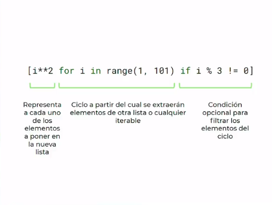
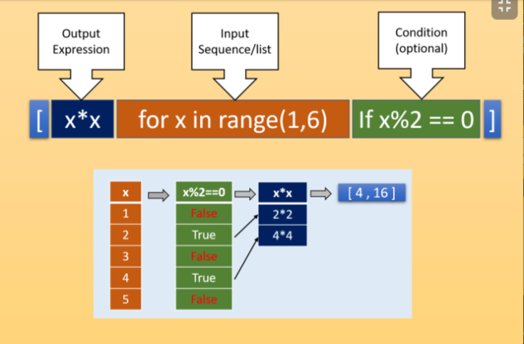

```
def run():
    my_list = [i for i in range(1, 100000) if i % 4 == 0 and i % 6 == 0 and i % 9 == 0]
    print(my_list)


if __name__ == '__main__':
    run()
```

## Dictionary comprehensions

```
def run():

    my_dict = {i : round(i**0.5,2) for i in  range(1,1001)}

    print(my_dict)

if __name__=='__main__':
    run()
```

```Python
import math

def run():
    dict = {number:round(math.sqrt(number),2) for number in range (1,1001)}

if __name__ == '__main__':
    run()
```

>Nota como leerlo: 
Para cada elemento de un iterable 1...n , yo voy a colocar una llave{} y un valor (n....), solamente si se cumple una condición 

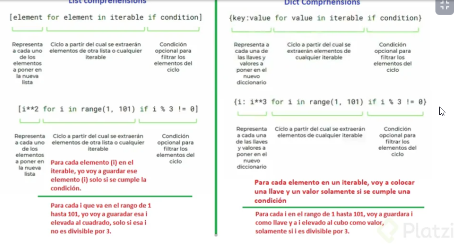


## Funciones anónimas: lambda 


> Son funciones de una linea cuyo identificador es la variable y retornan un objeto tipo función

**Caracteristicas **
- Es una función sin nombre es una función anonima
- No necesitan ser definidas como una función normal. 
¿Cuántos argumentos como máximo puede contener una función anónima? Infinitos 
- No necesitan que se le declare parametros de entrada. 
- Retorna el resultado por defecto. 
- las funciones lambda no deberían sustituir a las funciones def en python, 
- Usar las funciones lambda para sustituir una funcion def es una mala practica.
- lambda != arrow_func.
- No necesitamos retornar el return 
- Si vienes de Javascript es probable que quieras usar una funcion lambda como si fuera una arrow function, no hagas eso. 
- Una arrow function puede llegar a ser mucho mas completa y estas si pueden sustituir a una función clásica en Javascript.
- Las Funciones lambda solo deberían de usarse en caso muy específicos o para competencias de programación en las que tengas que programar lo mas rápido posible.
### Material 
 - https://stackoverflow.com/questions/25010167/e731-do-not-assign-a-lambda-expression-use-a-def
 - https://docs.python.org/3/tutorial/controlflow.html?highlight=lambda#lambda-expressions


```Python 
palindrome = lambda string: string == string[::-1]

```

## High order functions: filter, map y reduce

> son funciones que reciben como parámetro a otra función.

**Existen tres tipos ** 
>filter → 
- Recibe una función filtro (anónima) y un iterable (lista, tupla, etc) devolviendonos un iterador: objeto optimizado recorrer elemento a elemento (iterar) por lo que no lo podemos inprimir de manera directa (para ello lo convertimos a una lista). 
su sintaxis es: 
```Python  
filter(<funcion filtro>, <iterable>)
``` 

>Map → 
- Al igual que filter recibe una función anónima y un iterable como parámetros pero en este caso map ejecuta la función sobre cada uno de los elementos del iterable
su sintaxis es: 
```Python  
map(<funcion>, <iterable>)
``` 

>Reduce  → 
-  tenemos que importar esta función desde functools para poder usarla, tiene los mismos argumentos que las anteriores funciones, reduce el iterable por medio de la función anonima
¿Qué devuelve la función reduce? -> Un elemento unico 
su sintaxis es: 
```Python  
reduce(<funcion reduccion>, <iterable>)
``` 


**La diferencia entre filter y map:**

- Filter devuelve True or False según el valor esté dentro de los criterios buscados o no. 
- En caso de que no cumpla con la condición, no será devuelto y la lista se verá reducida por este filtro.
- Map funciona muy parecido, pero su diferencia radica en que no puede eliminar valores de la lista del array entregado. 
- Es decir, el output tiene la misma cantidad de valores que el input.
- Cómo funciona reduce:Reduce toma 2 valores entregados como parámetros y el iterador como otro parámetro. Realiza la función con estos 2 valores, y luego con el resultado de esto y el valor que le sigue en el array. Y así hasta pasar por todos los valores de la lista


```
from functools import reduce
def main():

    #Filter
    myList = [1,4,5,7,9,13,19,21]

    odd = list(filter(lambda x: x % 2 != 0, myList))
    print(odd)

    #Map
    myList2 = [1, 2, 3, 4, 5]

    squares = list(map(lambda x: x**2, myList2))
    print(squares)
	
	#Reduce 
    myList3 = [2, 2, 2, 2, 2]
    
    allMultiplied = reduce(lambda a, b: a * b, myList3)
    print(allMultiplied)

if __name__ == '__main__':
    main()
```

## Proyecto: filtrando datos

```Python 
DATA = [
    {
        'name': 'Facundo',
        'age': 72,
        'organization': 'Platzi',
        'position': 'Technical Coach',
        'language': 'python',
    },
    {
        'name': 'Luisana',
        'age': 33,
        'organization': 'Globant',
        'position': 'UX Designer',
        'language': 'javascript',
    },
    {
        'name': 'Héctor',
        'age': 19,
        'organization': 'Platzi',
        'position': 'Associate',
        'language': 'ruby',
    },
    {
        'name': 'Gabriel',
        'age': 20,
        'organization': 'Platzi',
        'position': 'Associate',
        'language': 'javascript',
    },
    {
        'name': 'Isabella',
        'age': 30,
        'organization': 'Platzi',
        'position': 'QA Manager',
        'language': 'java',
    },
    {
        'name': 'Karo',
        'age': 23,
        'organization': 'Everis',
        'position': 'Backend Developer',
        'language': 'python',
    },
    {
        'name': 'Ariel',
        'age': 32,
        'organization': 'Rappi',
        'position': 'Support',
        'language': '',
    },
    {
        'name': 'Juan',
        'age': 17,
        'organization': '',
        'position': 'Student',
        'language': 'go',
    },
    {
        'name': 'Pablo',
        'age': 32,
        'organization': 'Master',
        'position': 'Human Resources Manager',
        'language': 'python',
    },
    {
        'name': 'Lorena',
        'age': 56,
        'organization': 'Python Organization',
        'position': 'Language Maker',
        'language': 'python',
    },
]

def run():

    # Comprehensions solutions
    all_python_devs = [worker["name"] for worker in DATA if worker["language"] == "python"]
    
	all_Platzi_workers = [worker["name"] for worker in DATA if worker["organization"] == "Platzi"]
    
	adults =  [worker["name"] for worker in DATA if worker["age"] > 18]
    
	old_people = list(map(lambda worker: worker | {"old": worker["age"] > 70}, DATA))
    
	#Usando Filter 
	#Paso 1: people_adult = list(filter(lambda worker, DATA))
	#Paso 2: people_adult = list(filter(lambda worker:worker["age"]>18, DATA ))
	
	#Usando map 
	#Paso 1: adulto_name = list(map(lambda worker, DATA))
	#Paso 2: adulto_name = list(map(lambda worker: worker["name"], people_adult))
	
	#Usando filter y agregandi valor al data
	#Paso 1: adulto_add = list(map(lambda worker , DATA))
	#Paso 2: adulto_add = list(map(lambda worker: worker | {"old" : worker["age"] > 70 }, DATA))
	
	

    for worker in all_python_devs:
        print(worker)


if __name__ == '__main__':
    run()
```

> Nota : Con el | es la manera unir diccionarios , + podemos unir listas 


## Los errores en el código

**Errores en el código**

- Cuando python nos avisa que tenemos un error en el código nos avienta un mensaje que conocemos como traceback, puede ser debido a:
	- Errores de Sintaxis (SyntaxError) → escribimos mal alguna palabra clave (typo), el programa no se ejecuta.
	- Excepciones (Exeption) → Producen un colapso o interrupción de la lógica del programa en alguna línea en específico por ejemplo (todas las líneas anteriores se ejecutan), pueden ser de varios tipos, generalmente aparecen cuando no existe un componente clave en la ejecución o hay alguna imposibilidad lógica (matemática) para efectuar la instrucción, tambipen pueden generarse dentro del código o fuera de el (elevar una excepción)

> Lectura de un traceback

- La manera correcta de leer un traceback es iniciar por el final, en el caso de un error de sintaxis nos indicará en qué línea se encuentra dicho error.
- En el caso de excepciones la última línea nos indicará el tipo de exepcion que se generó (generalmente son autoexplicativas pero si no entienedes que paso puedes buscar este error)
- La penúltima línea nos indicará dende se encuentra el error (archivo y línea)
- La antepenúltima línea nos muestra “most recent call last” lo que significa que la llamada más reciente es la última (el programa se cerró después de esa llamada, se genero un error)

> Elevar una excepción

- Cuando tenemos una excepción en python lo que sucede es que se crea un objeto de tipo exception que se va moviendo a través de los bloques de código hasta llegar al bloque principal si es que no se maneja dicha excepción en algún bloque intermedio el programa se interrumpe y genera el traceback

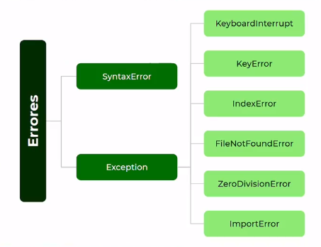

>TraceBack ->  es un mensaje que puedes ver de manera resumida en la pantalla 

> PD: Lo correcto es leer desde el final al principio los traceback (traza de error)

### Lectura 
- https://docs.python.org/3/tutorial/errors.html


## Debugging

> Es una herramienta que traen varios editores de código con el objetivo de solucionar nuestros errores de lógica. Revisemos la herramienta debugging de VSCode

**En este entorno podemos acceder a funcionalidades como:**
- pause → permite pausar la ejecución del programa
- step over → permite avanazr un solo paso en el programa
- step in → igresamos a un bloque secundario del programa (funciones)
- step out → salimos del bloque secundario
- restart → reinicia el programa
- stop → detiene el programa

- Además podemos generar breakpoints, que son puntos en los que el programa se detendrá para ayudarnos a depurar el código
> PD: Existen herramientas de debugging propias de python como el módulo pdb o los breakpoints (a partir de python 3.7)

**Ejemplo**
- Paso 1 
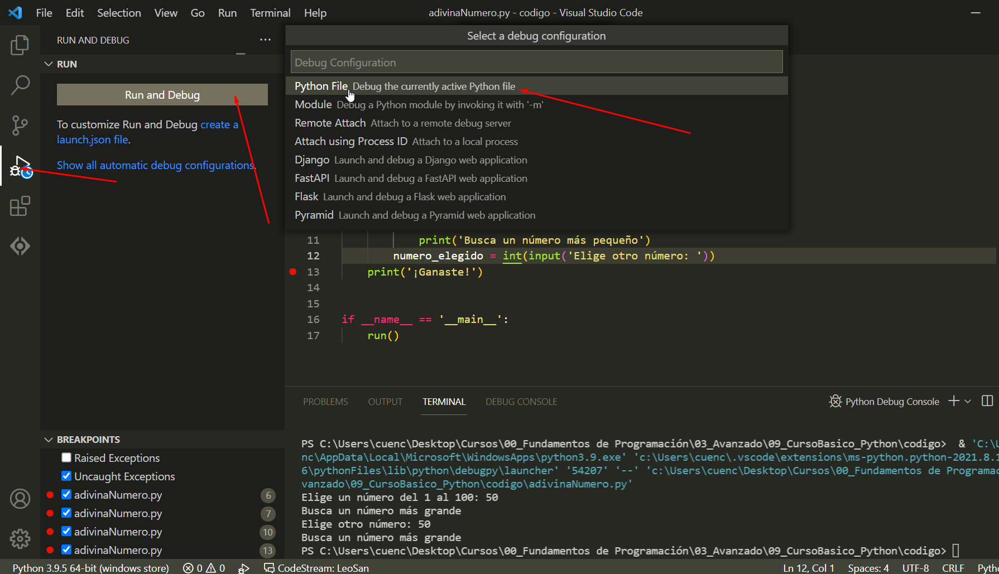

- Paso 2

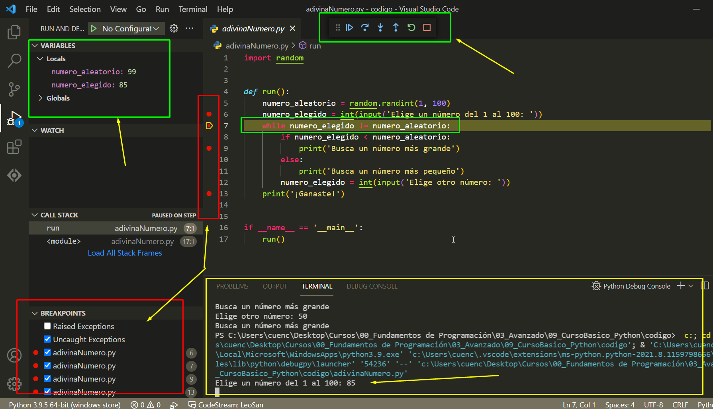

## Manejo de excepciones

**Rama de jerarquia **
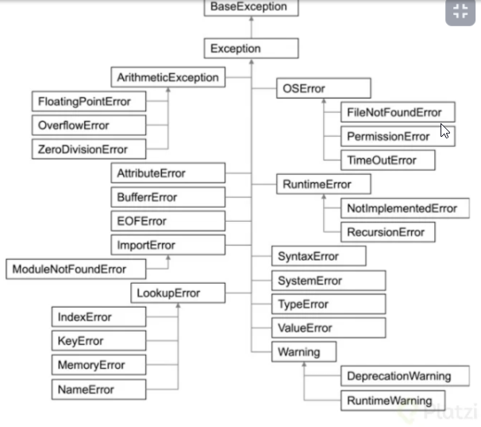


> try except → 
- Anidamos nuestro programa en dos bloques de código, 
- Bloque A: Es el programa per se (el que se ejecuta normalmente, sin errores) 
- Bloque B: Representa las instrucciones a seguir en caso de error.

**Su sintaxis es:**
```Python 
try:
	<bloque A>
except <error> as <alias>:
	<bloque B>
```
- <error> es un parámetro opcional, permite capturar sólo el tipo de error indicado, si no se coloca captura todos los errores posibles (es buena práctica capturar cada tipo de error por separado)
- <alias> nos permite crear un alias al error, para trabajar con él.


> raise → 
- Esta instrucción nos permite generar errores, es decir crear nuestros propios errores cuando detectemos que nuestro programa no actúa como debería con cierto tipo de datos

**Su sintaxis es:**
```Python 
    # Es como throw de js, java, php 
	raise <NombreError>("<descripci[on del error>")
```

> fynally → 
- Es una bloque de código que se ejecuta exista un error o no 
- Es un tercer bloque C después de try except
- No es muy usual pero puede darse para cerrar archivos, conexiones a BBDD o liberar recursos

```Python 
try:
	<bloque A>
except <error> as <alias>:
	<bloque B>
<bloque C>
```

**Ejemplo**

```Python 
def palindrome(string):
    try:
        if len(string) == 0:
            raise ValueError("No se pueden ingresar cadenas vacías")
        return string == string[::-1]
    except ValueError as ve:
        print(ve)
        return False


try:
    print(palindrome(""))
except TypeError:
    print("Solo se pueden ingresar strings")
	
```

### Lectura 
- https://docs.python.org/3/tutorial/errors.html#exceptions

## Assert statements (Afirmo que )

> Es un tipo de exepcion especial
- Los Assert nos sirven más para realizar test a nuestra app
- Es una manera poco usual de manejar los errores en python
- Evalúa una condicional, si esta se cumple continuamos con el flujo normal del python, si no se cumple eleva un error del tipo AssertionError y nos muestra un mensaje.
- Es decir yo como programador creo una nueva funcionalidad y afirmo que determinada función hace x cosa con un assert, 
- si este retorna false quiere decir que es error del programador

Sintaxis 
```
assert <condicion>, <"mensaje"> 
<Bloque de código>
```

**Ejemplos **

```Python 
def divisor(num):
    divisors = [i for i in range(1,num+1) if num%i == 0]
    return divisors

def run():
    num = input('Enter a number: ')
    assert num.isnumeric() and int(num)>0, 'Ingresa solo numeros positivos'
    print(divisor(int(num)))
    print('Finish')


if __name__ == '__main__':
    run()

```

## ¿Cómo trabajar con archivos?


> Archivo de texto 
- Presenta información legible para nosotros, puede representar texto plano (.txt), instrucciones de algún lenguaje de programación (.py. js) o información (.xml .json


Para abrir un archivo seguimos las siguiente estructura

with open(<ruta>, <modo_apertura>) as <nombre>

with Es un manejador contextual, nos ayuda a controlar el flujo del archivo (sirve para que el archivo no se dañe cuando existe algún cierre inesperado)

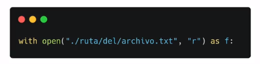

open(ruta,modo_apertura): es una función que necesita de dos parámetros

### Modos de Apertura

- r -> Solo lectura
- r+ -> Lectura y escritura
- w -> Solo escritura. Sobre escribe el archivo si existe. Crea el archivo si no existe
- w+ -> Escritura y lectura. Sobre escribe el archivo si existe. Crea el archivo si no existe
- a -> Añadido (agregar contenido). Crea el archivo si éste no existe -> ¿Qué letra simboliza el modo de escritura sin sobrescritura de un archivo en Python?
- a+ -> Añadido (agregar contenido) y lectura. Crea el archivo si éste no existe.

### Manejadores 

- with → manejador de archivos, permite manipular el archivo sin que este se rompa (en caso de error imprevisto)
- open → instruccion que permite abrir un archivo, sus parámetros son la direccion del archivo y el modo de apertura
- <alias> → podemos generar un alias para trabajar con el archivo dentro de python
