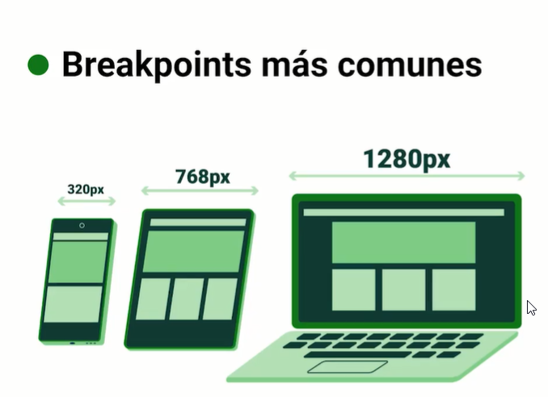

# 11 - Curso Básico de Tailwind 2 y 3

## Clase 1: Bienvenida 
- Profesor Ana María Díaz Solorio
```
Crea tu primer landing page utilizando Tailwind, un framework CSS que te permitirá agilizar el desarrollo de tus proyectos además de aplicar las mejores prácticas y herramientas que llegaron con Tailwind 2.0.
```
## Clase 2: Tailwind 3.0: ¿qué hay de nuevo? 💡

Hola, el proyecto de este curso fue creado con la versión 2.0 de Tailwind, pero en diciembre de 2021 salió la versión 3.0. Es muy importante que tengas en cuenta que cuando comiences el proyecto lo harás con esta nueva versión, lo cual no afectara para el desarrollo del proyecto.

De igual manera al finalizar el proyecto te mostraré como realizar una migración de tus proyectos 2.0 a la versión 3.0 de Tailwind.

A continuación te mostramos los cambios más importantes de la versión 3.0:

Rendimiento
Una de las mejoras más grandes es el modo de compilación Just in time engine (JIT) que llega a reemplazar el modo de compilación tradicional para reducir y optimizar el tiempo de compilación del archivo así como su peso.

Estilos nativos de formularios
Ahora es posible manipular los estilos nativos de un formulario haciendo uso de tailwind con la utilidad accent y la clase file.

Box shadow
Ahora también contamos con esta poderosa herramienta que integra una serie de colores para el sombreado con la cual es posible modificar su opacidad.

En este ejemplo podemos ver 3 botones que tienen un sombreado del mismo color que el botón, pero con una opacidad menor, creando un efecto de profundidad hermoso.

## Clase 3: ¿Cómo funciona Tailwind? Y otros frameworks de CSS 💡

> Framework CSS → Conjunto de herramientas para construir una interfaz web con CSS, que nos permite agilizar el desarrollo.

> Tailwind es un framework utility-first y está diseñado para acelerar el proceso de diseño al eliminar la necesidad de usar CSS.

**Características:**

- Representado mediante clases, definimos nuestros estilos.
- Orientado a utilidades, vuelve el desarrollo más personalizable.
- Personalizable, Tailwind es 100% personalizable a diferencia de otros frameworks.

**Otros frameworks de CSS:**

**Bootstrap:**
- Basado en componentes.
- Abstracción en la creación de los componentes.
- Poco personalizable.

**Material UI:**
- Basado en componentes pre-construidos.
- Basado en el tema de Material.
- Design System.

**Bulma:**
- Framework modular, permite importar los archivos que se necesiten utilizar.
- Personalizable, mediante la creación de variables en SASS se pueden agregar estilos personalizados.
- Basado en Flexbox.

## Clase 3: Mobile First y Utility First 💡

**Mobile First →** 
- Pensado principalmente para mejorar la experiencia de usuario.
- Permite identificar las partes más importantes de nuestro proyecto. 
- En otras palabras, prioriza el desarrollo pensando en los dispositivos móviles.

**Utility First →** 
- Basado en utilidades el cual permite tener una estructura más limpia de nuestros estilos, el desarrollo es más rápido ya que todo se trabaja dentro del mismo archivo. 
- En otras palabras, es la forma en que se nombran y se crean las clases de estilos, es decir, son clases descriptivas de la utilidad que nos dan. Se trata de construir componentes a partir de clases con nombres descriptivos.

## Clase 4-5: Creación del proyecto e instalación de Tailwind

Pasos para iniciar
- Paso 1:   Iniciar proyecto npm: `npm init`
- Paso 2: usaremos el modo PostCSS debemos ejecutar el siguiente comando recuerda debes ejecutar en el directorio donde estaras trabajando `npm install -D tailwindcss postcss autoprefixer`  
- Paso 3: Ejecutamos el siguiente comando `npx tailwindcss init`
Documentación de instalación: https://tailwindcss.com/docs/installation/using-postcss
- Paso 4: debemos anexar al archivo `tailwind.config.js` la siguiente documentación 
```
module.exports = {
  content: ['./public/index.html', './src/**/*.{html,js}'],
  theme: {
      extend: {},
  },
  plugins: [],
};
```
- Paso 5: Creamos un archivo `tailwind.css` bajo una ruta public/css/tailwind.css
anexamos las directivas 
```
@tailwind base;
@tailwind components;
@tailwind utilities;
``` 
- Paso 6: creamos nuestro html o cualquier componente y usamos las reglas de tailwind 
- No volides hacer esto en el html 
```` 
<link rel="stylesheet" href="../public/css/tailwind.css">
```` 
- Paso 7: debemos genear un build porque, no se ven los cambios. para esto debemos en el package.json anexar este comando para que tome los cambios

``` 
  "scripts": {
    "dev": "npx tailwindcss -i ./src/css/tailwind.css -o ./public/css/tailwind.css --watch",
    "prod": "npx tailwindcss -i ./src/css/tailwind.css -o ./public/css/tailwind.css --minify"
  },
``` 
## Clase 6: Directivas Tailwind CSS v3.0
>Una directiva es una instrucción que nos sirve para insertar código a nuestro archivo final CSS.

**Notas**

- @tailwind base → Inicializa todos los elementos de nuestro HTML sin estilo.
- @tailwind components → Nos permite acceder a todas las clases de tailwind.
- @tailwind utilities → Agrega todas las utilidades al proyecto y nos permite acceder a ellas.

**Otras directivas:**

- @tailwind → Inserta las directivas base, components, utilities y variants.
- @layer → Le dice a tailwind a qué bloque de código pertenece un conjunto de estilos personalizados. Las capas válidas son base, componentes y utilidades.
- @apply → Incorpora cualquier clase de Tailwind en el CSS personalizado, es útil cuando se necesita escribir CSS personalizado.
- @variants → Es útil para controlar dónde Tailwind inyecta el hover, focus, responsive u otras variantes de cada clase.
Las directivas se diferencian por un @ al inicio, también se tienen las funciones screen() y theme().

**Doc**
- https://v2.tailwindcss.com/docs/functions-and-directives

## Clase 7 : Nueva paleta de colores extendida
**Doc**
- https://v2.tailwindcss.com/docs/customizing-colors
- Manejar TailWind de manera real -> https://play.tailwindcss.com/
- Manejador de Colores -> https://www.peko-step.com/es/tool/hslrgb.html
**Agregar Colores**
```
module.exports = {
  content: ['./public/index.html', './src/**/*.{html,js}'],
  theme: {
  extend: {
    colors:{
     primary:'#34a853',
     secondary:'#353535'
    },      
    }
  },
  plugins: [],
};

// Otra forma 

module.exports = {
  content: ['./public/index.html', './src/**/*.{html,js}'],
  theme: {
    extend: {
      colors: {
        ngreen: {
          50: '#E8FCF0',
          100: '#D1F9E2',
          200: '#BAF7D4',
          300: '#8CF2B8',
          400: '#30E880',
          500: '#16CE66',
          600: '#11A04F',
          700: '#0C6F38',
          800: '#074422',
          900: '#02160B',
        },
        nred: {
          50: '#FAE9E9',
          100: '#F6D4D4',
          200: '#EEA9A9',
          300: '#E67E7E',
          400: '#DE5353',
          500: '#D42828',
          600: '#AB2020',
          700: '#801818',
          800: '#551010',
          900: '#1D0505',
        },
        nyellow: {
          50: '#FEF7E5',
          100: '#FEF0CC',
          200: '#FDE19A',
          300: '#FDD267',
          400: '#FCC435',
          500: '#FDBA0B',
          600: '#C99102',
          700: '#976C01',
          800: '#644801',
          900: '#191200',
        },
      }
    },
  },
  plugins: [],
};

```
## Clase 8: Medidas y Breakpoints

> Son las medidas standar que usaremos para las pantallas durante el desarrollo 

- Un breakpoint es el salto en el que cambia la pantalla de layout. 
- Se pueden manipular los estilos de nuestro archivo en función al tipo de dispositivo.
- Debido a que Tailwind es mobile first, todo el tiempo se estará trabajando con el breakpoint small.
- Podemos manejar medidas estaticas o relativas. las estaticas por REM  y las relativas por % 
- Podemos usar la propiedad `h-auto` le indicamos que se ajuste 


**Doc**
- https://v2.tailwindcss.com/docs/breakpoints

- sm - 640px
- md - 768px
- lg - 1024px
- xl - 1280px
- 2xl - 1536px

```
Ejemplo práctico

<div class=“w-auto h-screen bg-sky-200 flex”>
<div class=“w-1/4 h-1/4 bg-sky-700”></div>
<div class=“w-1/4 h-1/4 bg-cyan-400”></div>
<div class=“w-1/3 h-1/4 bg-cyan-700”></div>
<div class=“w-1/4 h-1/4 bg-cyan-900”></div>
</div>
```
