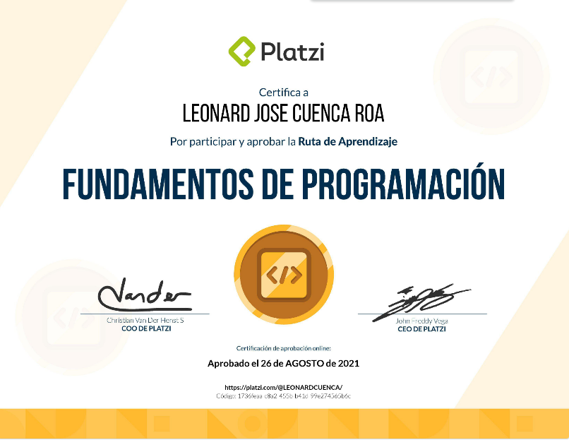

# Carrer Fundamental Developer 
`It is always good to go back to the basics and as part of professional improvement and the entrepreneurial spirit of unlearning to improve, this course has the purpose of going back to the basics to validate what can be improved and what must be learned again. the fundamentals of the race.
`

## Plan of Study
-  [Basic](https://github.com/LeoSan/CarreraFundamentosProgramacion_Platzi_2021/tree/main/01_Basico)
-  [Medium](https://github.com/LeoSan/CarreraFundamentosProgramacion_Platzi_2021/tree/main/02_Intermedio)
-  [Advanced](https://github.com/LeoSan/CarreraFundamentosProgramacion_Platzi_2021/tree/main/03_Avanzado)
-  [Seguridad](https://github.com/LeoSan/CarreraFundamentosProgramacion_Platzi_2021/tree/main/04_Seguridad)

## Certificate Final

